# ☁️ Pre-Configuración de Entorno para Servicios de AI en Oracle Cloud Infrastructure (OCI)

## 📘 Introducción

Este documento describe los **prerrequisitos y configuraciones necesarias** para preparar un entorno de trabajo funcional en **Oracle Cloud Infrastructure (OCI)**, orientado a proyectos y laboratorios de **Inteligencia Artificial (AI)** y **Data Science**.

Incluye dos secciones principales:

1. **Configuración de acceso y seguridad:** Creación de API Keys, compartimentos y políticas.
2. **Configuración de infraestructura base:** Creación de redes, bases de datos y una instancia Windows Server.

> ⚠️ Este procedimiento **no es un laboratorio práctico**, sino un conjunto de **pasos previos obligatorios** antes de ejecutar los ejercicios principales o despliegues de modelos AI.

---

## 🧩 1. Creación de un API Key para la Autenticación

El **API Key** permite autenticar de forma segura las conexiones con los servicios de AI dentro del entorno de Data Science.

### Pasos

1. Abra el ícono del menú en la parte superior izquierda de la consola y seleccione su **perfil de usuario**.  
   
   

2. Ingrese en la pestaña **Tokens and Keys**.  
   
   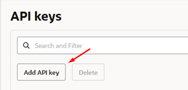

3. En la sección **API Keys**, haga clic en **Adicionar**.

4. Seleccione **Generar API Key** y descargue los dos archivos que aparecen en la parte inferior de la ventana.  
   
   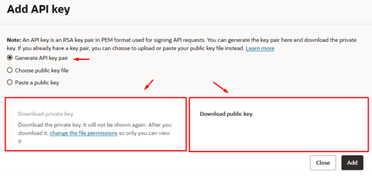

5. Finalmente, haga clic en **ADD** para completar el proceso.

6. Visualice la configuración del archivo generado y **copie la información necesaria**, ya que se utilizará posteriormente en la configuración de acceso.  
   
   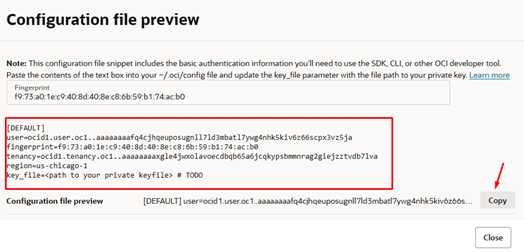

---

## 🗂️ 2. Creación de un Compartimento de Trabajo

El **compartimiento** (Compartment) permite organizar y aislar los recursos de su entorno de Data Science.

### Pasos

1. En el menú de navegación, seleccione **Identidad y seguridad → Compartimentos**.  
   
   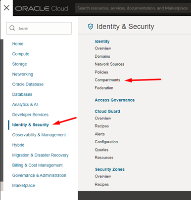

2. Haga clic en **Crear compartimento**.  
   
   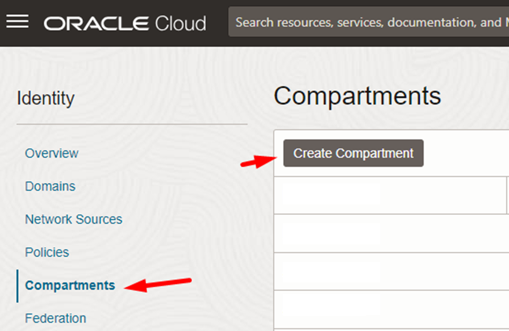

3. Asigne un nombre al nuevo compartimento, por ejemplo:  
   ```
   AIWORKSHOP
   ```
   y añada una descripción.

4. Presione **Crear compartimento**.

5. Confirme que el nuevo compartimento aparece en la lista.  
   
   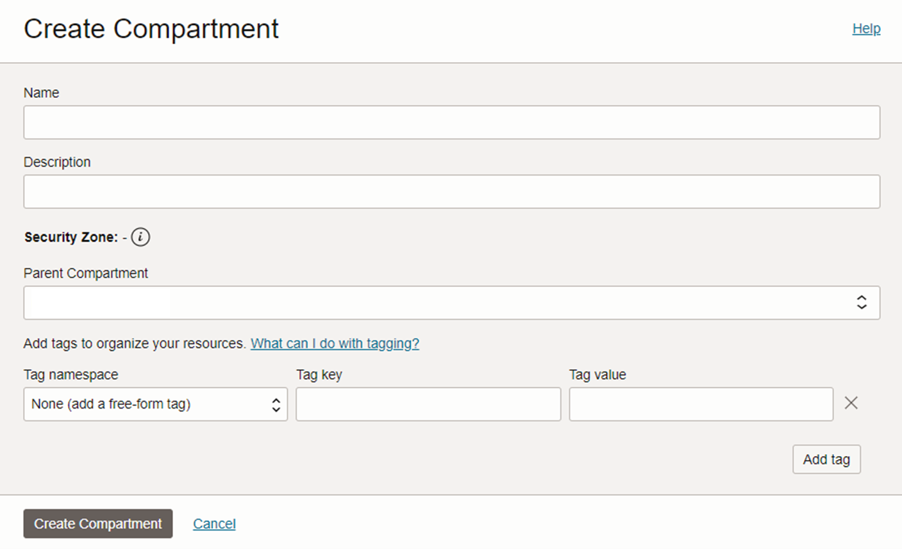

---

## ⚙️ 3. Creación de Políticas (Policies)

Antes de iniciar sesiones en los notebooks de *Data Science*, es necesario definir políticas de acceso que permitan a los servicios interactuar correctamente.

### Pasos

1. En el menú de navegación, diríjase a **Identidad y seguridad → Políticas**.  
   
   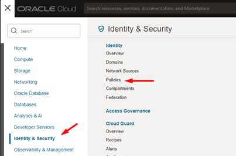

2. Haga clic en **Crear política**.  
   
   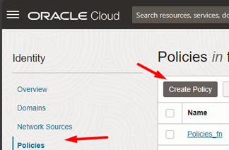

3. Complete los siguientes campos:
   - **Nombre:** `policy`
   - **Descripción:** Política para los usuarios y el servicio de ciencia.
   - **Compartimento:** `root`

4. Seleccione **Mostrar editor manual** e introduzca las siguientes sentencias:

   ```text
   Allow group Administrators to manage all-resources in tenancy
   Allow service datascience to use data-science-family in tenancy
   ```

5. Haga clic en **Crear** para guardar la política.  
   
   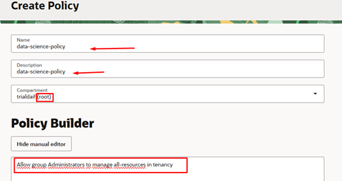

---

## 🧱 4. Creación de una VCN y Subred

La **Virtual Cloud Network (VCN)** es la red virtual que conecta los recursos de cómputo, bases de datos y servicios AI dentro del entorno OCI.

### Pasos

1. Abra el menú de navegación y seleccione:  
   **Red → Redes virtuales en la nube (VCN)**.  
   
   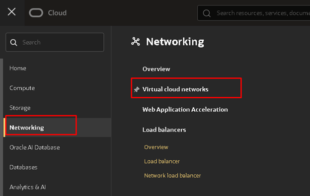

2. Haga clic en **Iniciar asistente de VCN**.  
   
   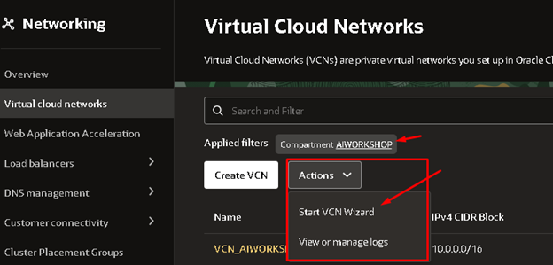

3. Seleccione la opción **Crear una VCN con conexión a Internet** y haga clic en **Iniciar asistente de VCN**.  
   
   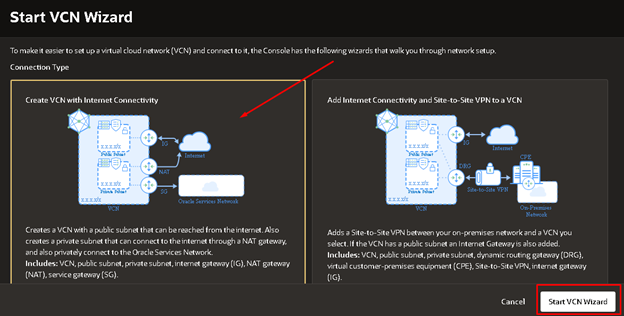

4. Complete los siguientes datos:
   - **Nombre de la VCN:** `vcn_workshop`
   - **Compartimento:** `AIWORKSHOP`

5. En *Configurar VCN y subredes*, mantenga los valores por defecto:
   ```
   Bloque CIDR de VCN: 10.0.0.0/16
   Bloque CIDR de subred pública: 10.0.0.0/24
   Bloque CIDR de subred privada: 10.0.1.0/24
   Usar nombres de host DNS: Activado
   ```

6. Haga clic en **Siguiente**, revise la configuración general y finalmente en **Crear**.

7. Verifique que se hayan creado los componentes:
   - Subred pública  
   - Subred privada  
   - Internet Gateway  
   - NAT Gateway  
   - Service Gateway  

8. Seleccione **Ver red virtual en la nube** para validar que la VCN y subredes fueron creadas correctamente.  
   
   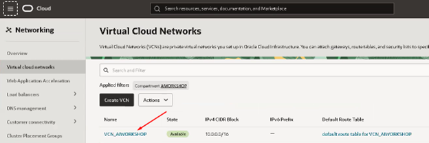

---

## 🔒 5. Configuración de Listas de Seguridad

Para permitir el acceso remoto a la futura máquina Windows, será necesario abrir el puerto **3389,5678 (RDP)**.

1. En el menú de la VCN, seleccione **Seguridad**.  
   
   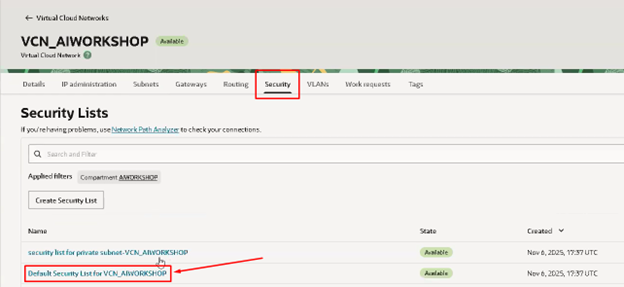

2. Abra las **Reglas de seguridad por defecto** y haga clic en **Agregar regla de entrada**.

3. Configure los siguientes valores:
   - **Protocolo:** TCP  
   - **Puerto de destino:** 3389,5678  
   - **Origen:** 0.0.0.0/0  
   - **Descripción:** Acceso remoto (RDP)

4. Guarde los cambios y confirme la nueva regla.  
   
   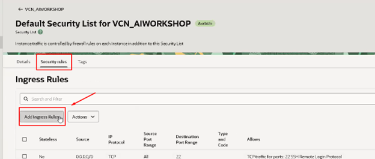  
   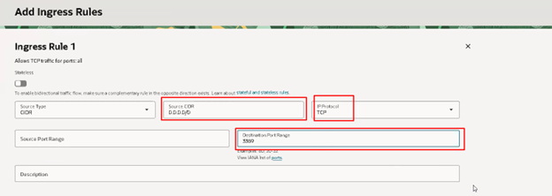

---

## 🗄️ 6. Aprovisionamiento de una Base de Datos Autónoma (ADB)

La **Autonomous Database (ADB)** permite crear un entorno de base de datos totalmente administrado, ideal para ejecutar cargas analíticas (Data Warehouse).

### Pasos

1. En el menú de navegación, seleccione:  
   **Base de datos Oracle → Almacén de datos autónomo (Autonomous Data Warehouse)**.  
   
   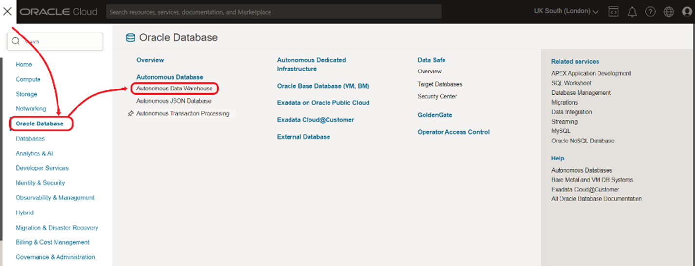

2. Haga clic en **Crear base de datos autónoma**.  
   
   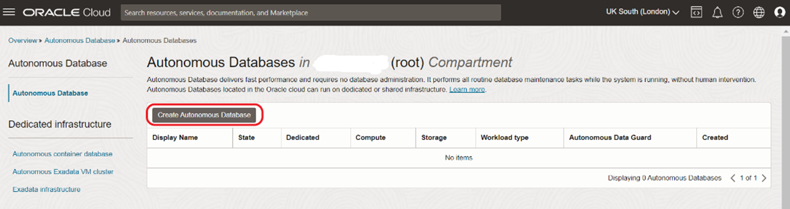

3. Complete la primera parte del formulario con los siguientes valores:

   | Campo | Valor |
   |--------|--------|
   | Compartimento | Seleccione el compartimento configurado |
   | Nombre para mostrar | `PL` |
   | Nombre de la base de datos | `PL` |
   | Tipo de carga de trabajo | Lakehouse |
   | Tipo de despliegue | Sin servidor |

   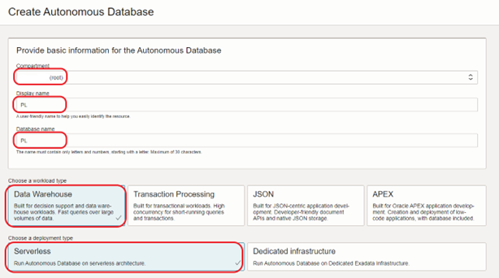

4. Complete la siguiente sección con:

   | Campo | Valor |
   |--------|--------|
   | Versión de la base de datos | 19c (o 26ai si su región lo soporta) |
   | Recuento de ECPU | 2 |
   | Almacenamiento (TB) | 1 |
   | Autoescalado de cálculo | Activado |
   | Autoescalado de almacenamiento | Activado |

   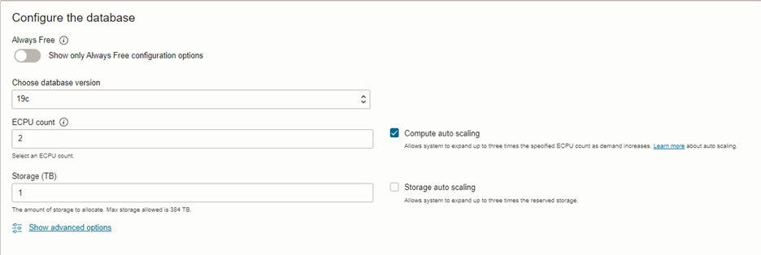

5. En la última parte del formulario:

   | Campo | Valor |
   |--------|--------|
   | Contraseña | Ingrese una contraseña segura |
   | Confirmar contraseña | Reingrese la contraseña |
   | Tipo de acceso | Acceso seguro desde cualquier lugar |
   | Tipo de licencia | Licencia incluida |

   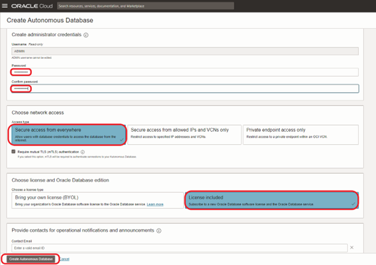

6. Haga clic en **Crear base de datos autónoma**.

7. Espere hasta que el estado cambie de *Provisioning* a *Available*.  
   
     
   

---

## 💻 7. Creación de una Instancia Windows Server 2022

Una vez creada la red y la base de datos, el siguiente paso es desplegar una **instancia Windows Server 2022** para conectar y operar los laboratorios.

### Pasos

1. En el menú principal, vaya a: **Compute → Instances**.  
   
   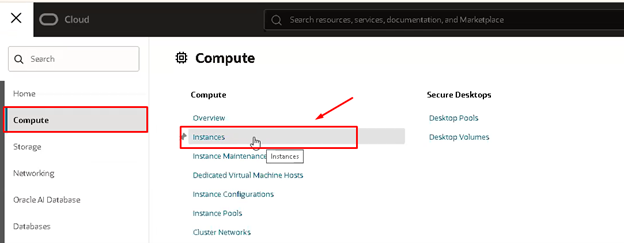

2. Seleccione el **compartimento** correspondiente y haga clic en **Create Instance**.  
   
   

3. En **Imagen**, seleccione:
   - **Sistema operativo:** Windows Server 2022  
   
   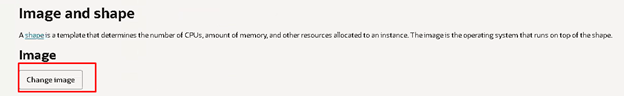  
   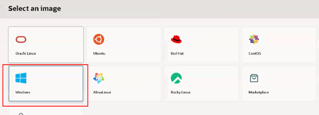

4. Confirme con **Select Image**.  
   
   

5. En **Shape**, asigne los recursos:
   - 4 OCPUs  
   - 48 GB de RAM  
  
   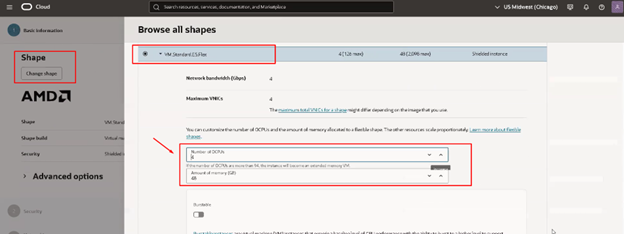

6. En la sección de **Red**, seleccione la **VCN y subred pública** creadas anteriormente.  
   
   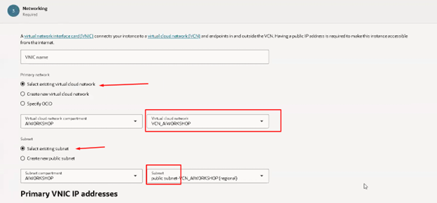

7. Continúe con **Next** hasta finalizar la creación.  
   
   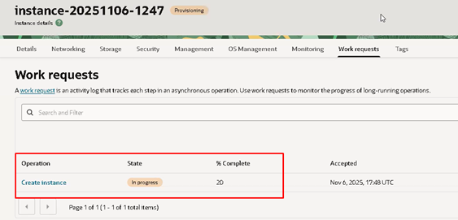

8. Una vez aprovisionada la máquina, conéctese mediante **Escritorio remoto (RDP)** con la **IP pública** asignada.  
   
   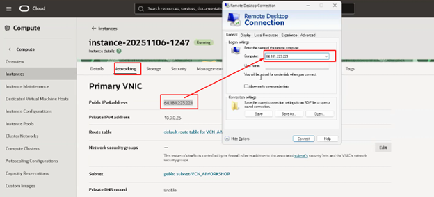

9. Inicie sesión con el **usuario y contraseña** indicados en la pestaña **Details** de la consola OCI.  
   
   

10. Durante el primer ingreso, cambie la contraseña y listo terminamos los prerrequisitos.
    
---

## 🧾 Notas Finales

- 🔒 Guarde sus claves privadas de forma segura.  
- 🚫 No comparta su archivo `oci_api_key.pem` con terceros.  
- ✅ Revise que las políticas estén correctamente aplicadas antes de ejecutar notebooks o scripts en Data Science.  
- 📁 Mantenga permisos restringidos en sus claves y archivos de configuración.

---

**© 2025 Oracle Cloud AI Workshop**  
*Documento unificado de prerrequisitos y configuración de entorno para laboratorios de AI y Data Science en Oracle Cloud Infrastructure.*
