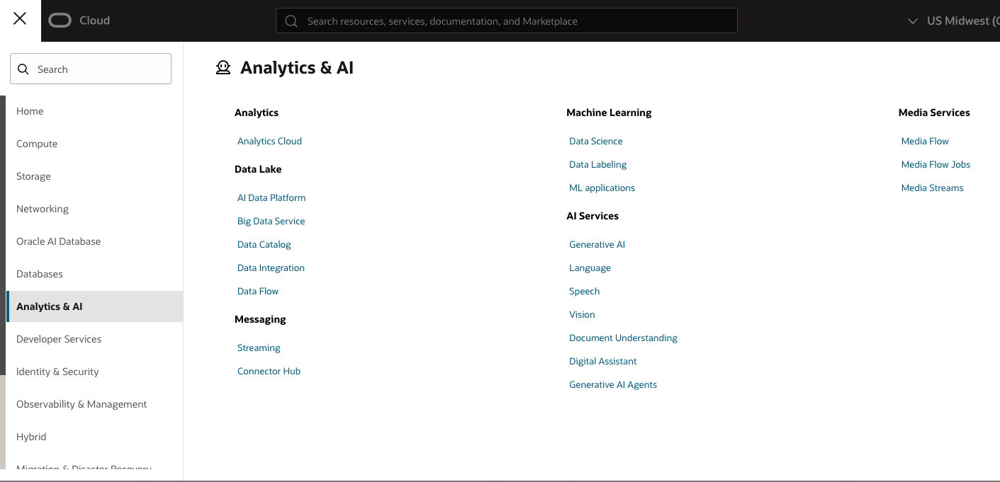
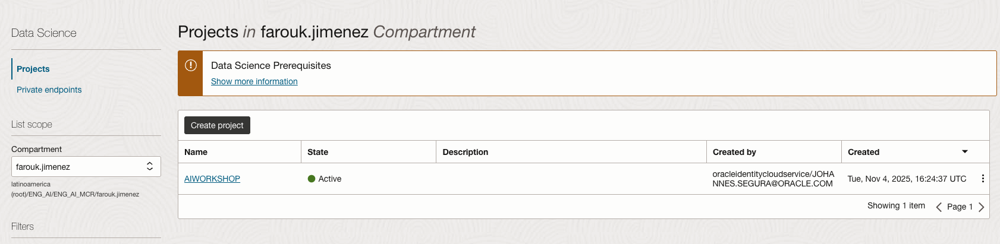
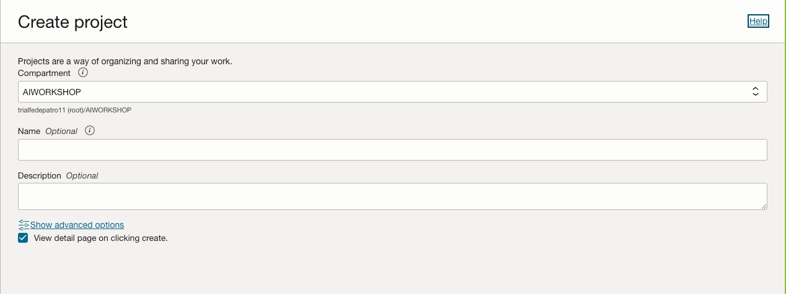
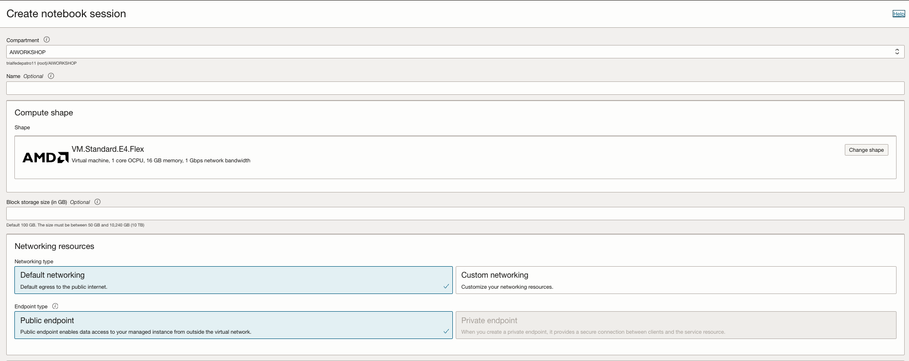
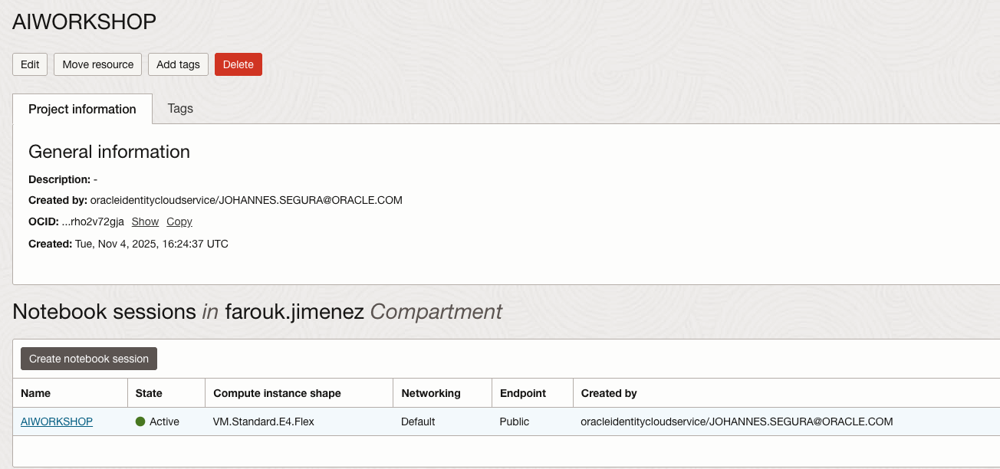
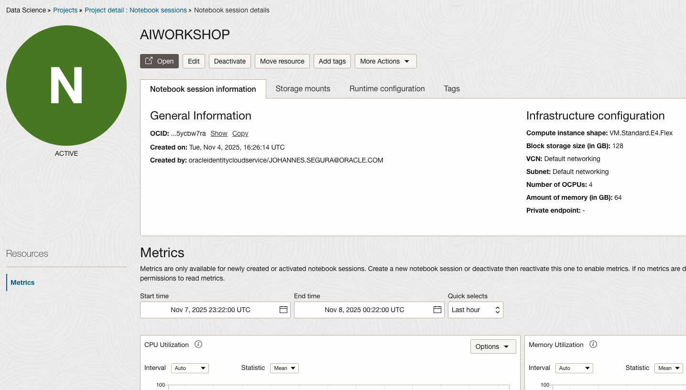
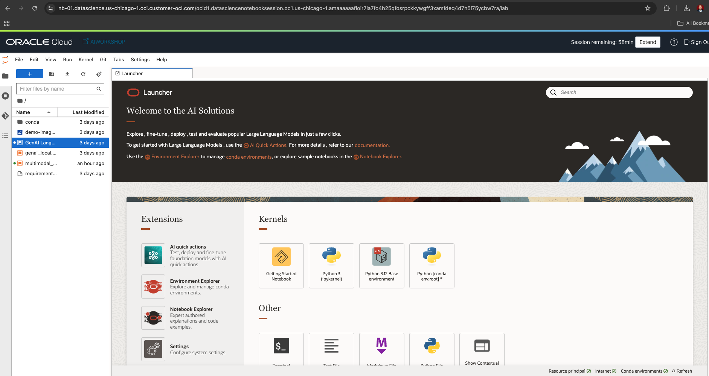

# 🧪 Lab 02 Uso de Servicio DataScience y Modelos de IA Generativa
## 🚀 Tarea 1 Despliegue Servicio
Dentro del menú principal de OCI 🔗 vamos a la opción **Analytics & AI** y buscamos la opción en **"Machine Learning"** 🤖 y damos click en la opción de **Data Science**.

Luego que ingresas a la opción de Data Science debes darle click en `Create Project` ➕

Indicar el compartment y nombre del proyecto `AIWORKSHOP` 🏷️

Dentro del proyecto vamos a crear un notebook de Data Science 📓.

Dar click en el botón `Create notebook session` 🆕

Debes hacer los siguientes pasos:
- 📝 Indicar un nombre para el **notebook**
- ⚙️ Cambiar la configuración del `Shape de Cómputo (agregar 2 OCPUs y 32 RAM)`
- 💾 En el campo Block Storage indicar `100 GB`
- ✅ Mantener las otras opciones tal cual vienen y dar click en el botón `Create`

### 🖥️ Acceso al Notebook

Luego que la máquina está provisionada ⏳ darle `click` en el hipervínculo para trabajar con DataScience.

Y dentro de esta opción vamos a ver un botón en la parte superior de `OPEN` 🔓 que abre el notebook de Jupyter.

Cuando se abre una nueva pestaña en su navegador 🌐 el servicio se muestra como un notebook de Jupyter de la siguiente manera.

## 📂 Copia de Archivos

De los archivos que se encuentran en este git debes descargarlos a tu computador 💻:

- 📓 **01_GenAI_Langchain.ipynb**
- 📓 **02_multimodal_genai_local.ipynb** 
- 📓 **03_genai_local.ipynb**
- 🖼️ **demo-image.jpeg**

Luego de tenerlo en tu PC vas a cargarlos al servicio de DataScience tomando los archivos y los arrastras ⬆️ a la zona indicada en la siguiente imagen.

---
## 🔐 Copia del archivo .pem

La llave privada generada en el setup inicial que se guardó en el archivo `.pem` 🗝️.

También debe cargarse de la misma manera que con los notebooks ⬆️.

> **⚠️ Importante:** El archivo debe tener el siguiente nombre dentro de DataScience para poder usarlo: `oci_api_key.pem`. Puedes renombrarlo antes de subir dicho archivo al servicio.
