# 🤖 Laboratorio 03 Agentes en OCI

### 📁 2.1 Subir los archivos para que el agente tenga acceso en el bucket
Como prerrequisito debes tener acceso a la consola de `OCI`, como en la imagen de abajo. 
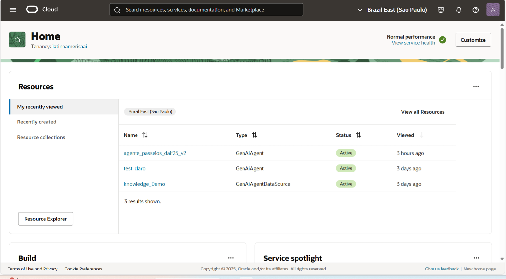

En el menú lateral izquierdo, conocido como menú `hamburguesa`, vamos a buscar Storage y acceder al servicio Bucket. Bucket es un servicio de almacenamiento de archivos, muy utilizado como un repositorio seguro dentro de los entornos corporativos. 
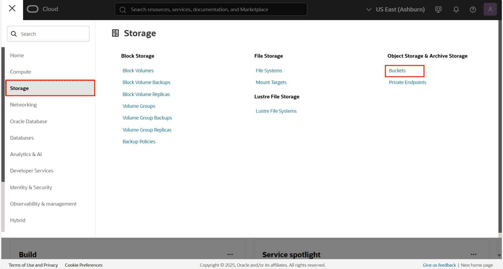

La pantalla principal del servicio debe mostrar todos los buckets que tienes creados en el tenancy, región y compartimento que estén seleccionados. 
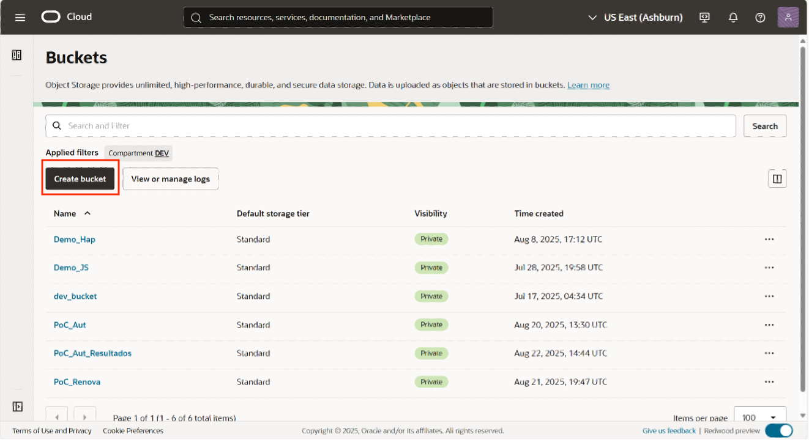

Haz clic en `Create bucket`. 

Dejaremos todas las configuraciones por `defecto`. La única modificación recomendada es ingresar el siguiente nombre: `Bucket_Test` 🏷️ que sea fácil de encontrar; más adelante tendremos que seleccionar este bucket creado. Después de cambiar el nombre, haz clic en `Create bucket`. 
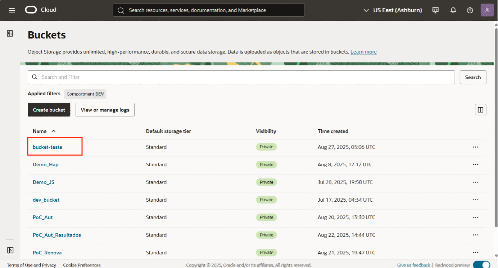

Enseguida, tu bucket ya debería figurar como disponible. Accédelo haciendo clic en su nombre. 
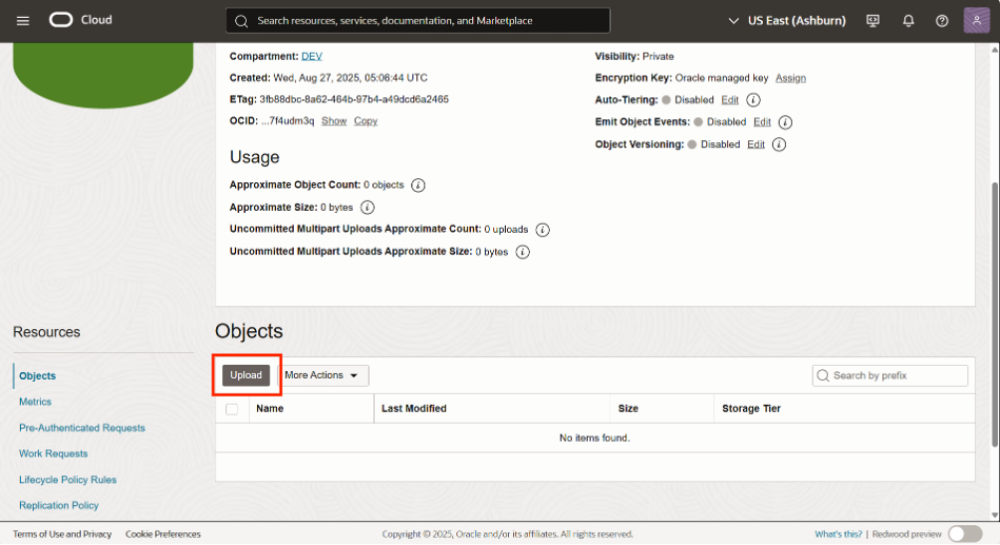

Dentro del bucket, deberías encontrar un botón más abajo en la pantalla con la opción de subir archivos. Puedes tener la versión de arriba o la de abajo. Son versiones de la interfaz de OCI: la versión de arriba es la antigua y la de la imagen de abajo es la nueva. De todos modos, encontrarás fácilmente el botón de subida en la pantalla; haz clic en él. 
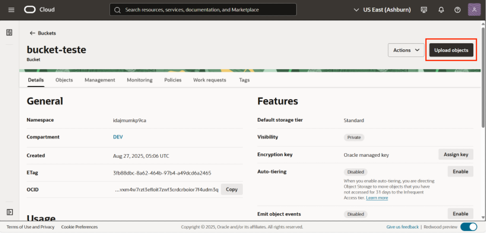

No necesitas modificar nada en esta pantalla; solo agrega los archivos mediante `arrastrar y soltar` ⬆️, donde debes descargar el archivo `Oracle Generativa AI.pdf` 📄 que se encuentra en el Git para subirlo al bucket como se ve en la siguiente imagen, una vez cargado el archivo, hacemos clic en "Next" 
 
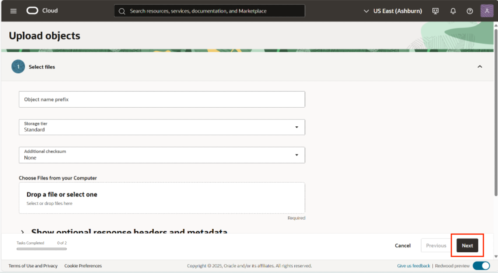

Hacer clic en `Next` hasta que encuentres el botón de `Upload files`, como en la pantalla de abajo. En ese momento, el sistema ya habrá concluido la adición de los archivos seleccionados y podrás cerrar esta pantalla con `Close` en la esquina inferior derecha. 
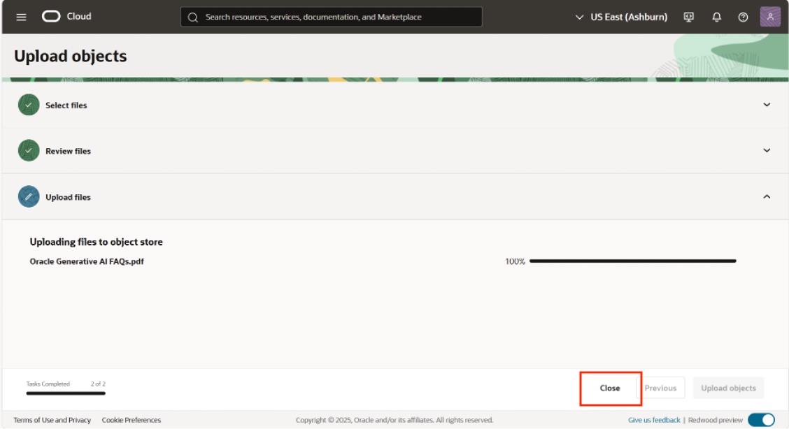

Verifica los documentos añadidos accediendo a `Objects` dentro del bucket. 
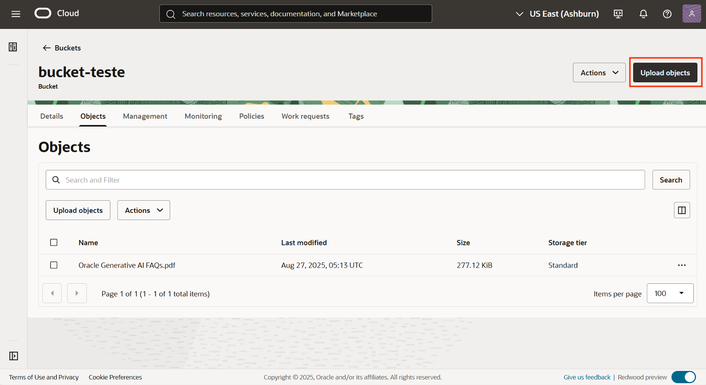

### 🛠️ 2.2 Creación del agente
Ahora que ya tienes los documentos que tu agente utilizará como base de conocimiento, comencemos la creación del agente utilizando el servicio de Agentes OCI de Oracle. Para ello, vuelve al menú hamburguesa y selecciona el menú: `Analytics & AI`, buscando la opción `Generative AI Agents`. 
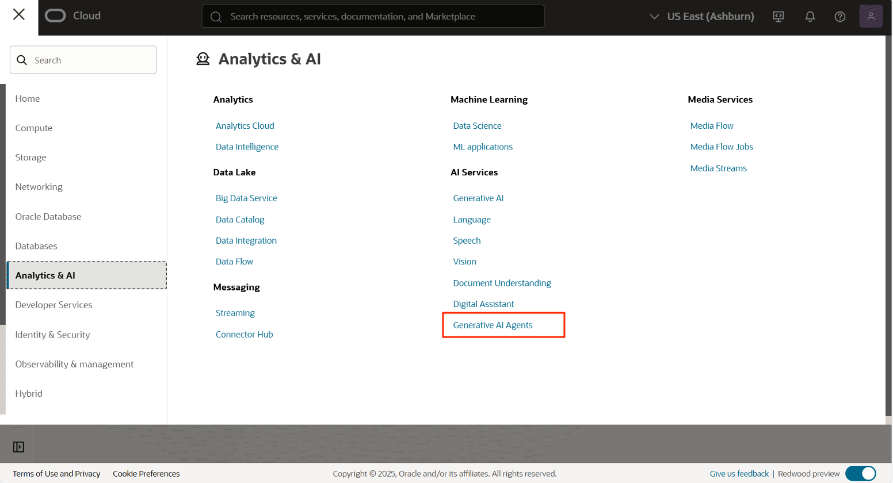

La pantalla que aparece es la interfaz del servicio de agentes. En la página de resumen (overview) es posible ver los pasos simples para la creación de un agente. En el menú lateral izquierdo también existe la pestaña `Agents`, que lista todos los agentes creados; `Knowledge Base`, que lista las bases de conocimiento desarrolladas, activas o eliminadas; y el menú `Chat`, que te permite conversar con un agente activo. 
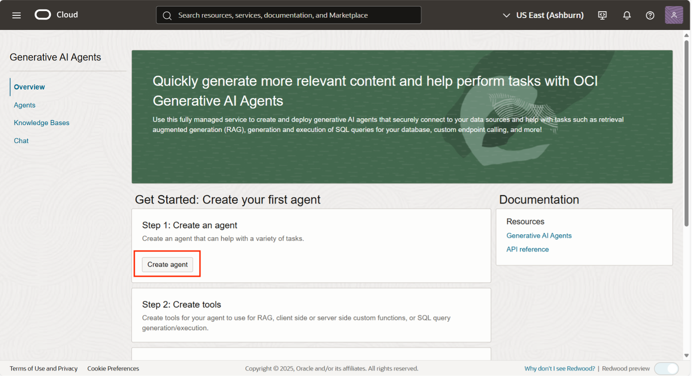

Haz clic en `Create agent` en el centro de la pantalla para comenzar la creación de nuestro agente. 
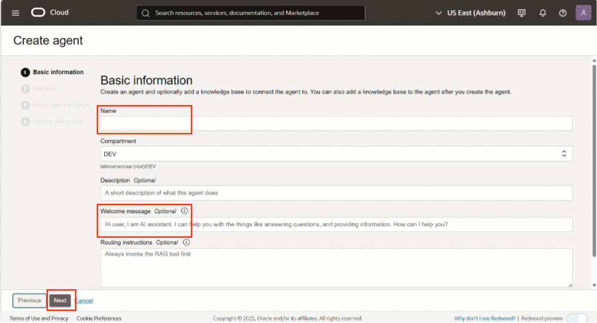

El primer paso se compone de información básica del agente. Es obligatorio añadir un nombre para tu agente, utiliza el siguien nombre: `AgentRag`. También puedes agregar un mensaje inicial en `Welcome message`, podemos poner: `¿Como puedo apoyarte el día de hoy?`. Una descripción interna para identificar de qué se trata este agente y rutas de instrucción para añadir reglas sobre cómo debe actuar en cada nueva ejecución. En este momento, solo añadiremos el nombre y el mensaje de bienvenida; puedes dejar los demás campos vacíos. Cuando finalices, haz clic en el botón inferior izquierdo `Next`. 
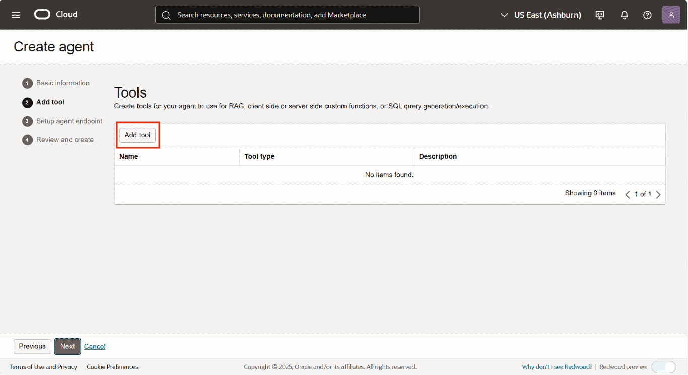

El segundo paso se compone de uno de los elementos más importantes de un agente: sus herramientas. En esta etapa haremos clic en el botón de añadir herramientas `Add tool`. 
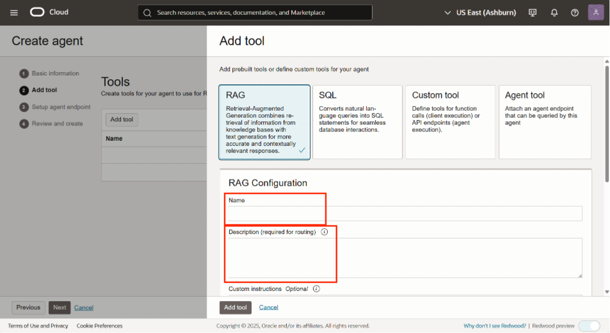

Hay varias herramientas preconstruidas.  
📝 RAG para procesar información no estructurada, como textos.  
🗄️ SQL para información estructurada, como bases de datos transaccionales.  
🔧 Custom tool para funciones o endpoints de servicios. Y finalmente.   
🤖 Agent tool para añadir una capa multi-agente, permitiendo que un agente sea agregado como un recurso para otro agente.  
En este laboratorio, como vamos a utilizar PDFs para alimentar la base de conocimientos, usaremos solo la primera opción, RAG.  
En la opción RAG, necesitaremos completar un nombre en el campo `Name` pondremos: `Rag_Tool` y un prompt descriptivo en el campo `Description` que compartimos a continuación. Ese prompt es exactamente las instrucciones que el agente usará para armar las respuestas para el usuario final sobre tu base de conocimiento: `Eres un especialista en responder sobre los servicios de IA de Oracle. Sé amable y resolutivo; debes responder de manera clara y directa. No inventes información más allá de lo que hay en la base de conocimiento. Atiende las necesidades del usuario.`
 
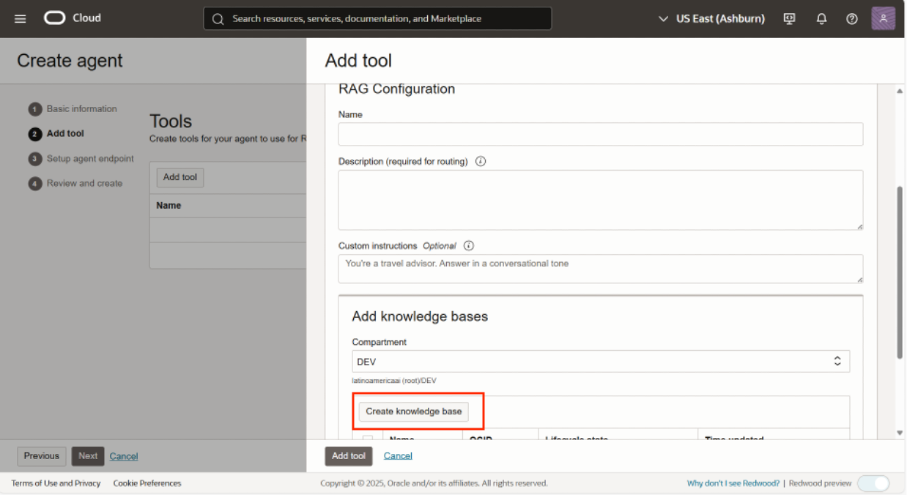

Una vez completado, vamos a crear una base de conocimiento haciendo clic en el botón “Create knowledge base”. Utilizar el siguiente `nombre`: `KnowledgeBase`  

En esta pantalla solo vamos a señalar el bucket que creamos en el punto anterior. Haz clic en `Specify data source` y encuentra tu bucket en las opciones listadas. Recuerda estar en la misma región en la que creaste el bucket; de lo contrario, no aparecerá en la lista. 
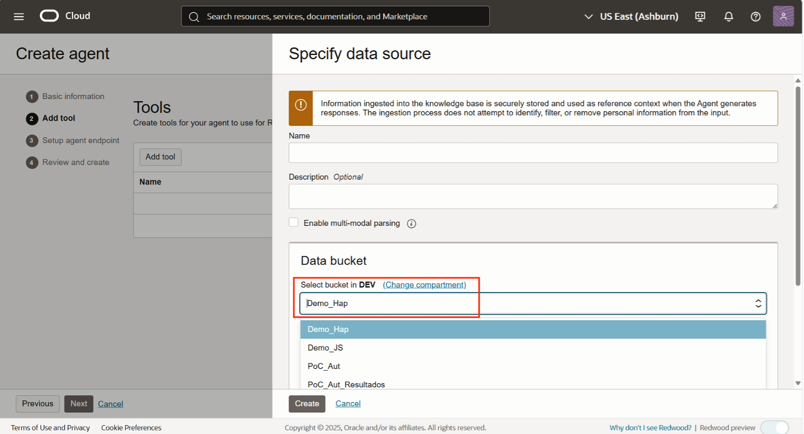

Selecciona tu bucket y, en la misma pantalla, verás todos los archivos que están presentes en él. Debes marcar la opción de seleccionar todo lo que hay dentro del bucket, como en el ejemplo de abajo, o seleccionar solo los archivos que deseas insertar en la base del agente. Observa que solo acepta `PDF 📄, TXT 📝, HTML 🌐, JSON 📋 y MD 📑`; cualquier otro formato de archivo será ignorado. 
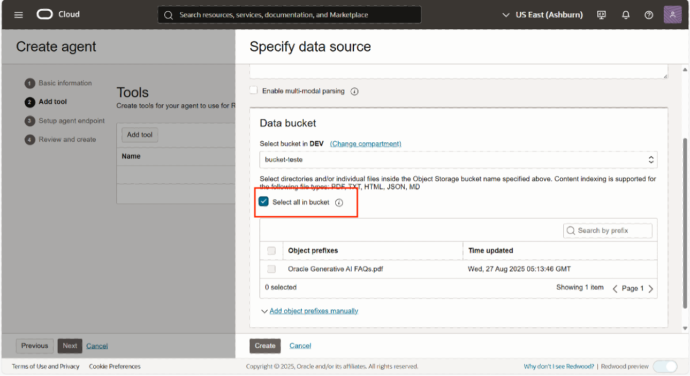

Una vez que los archivos estén seleccionados, haz clic en `Create`. 
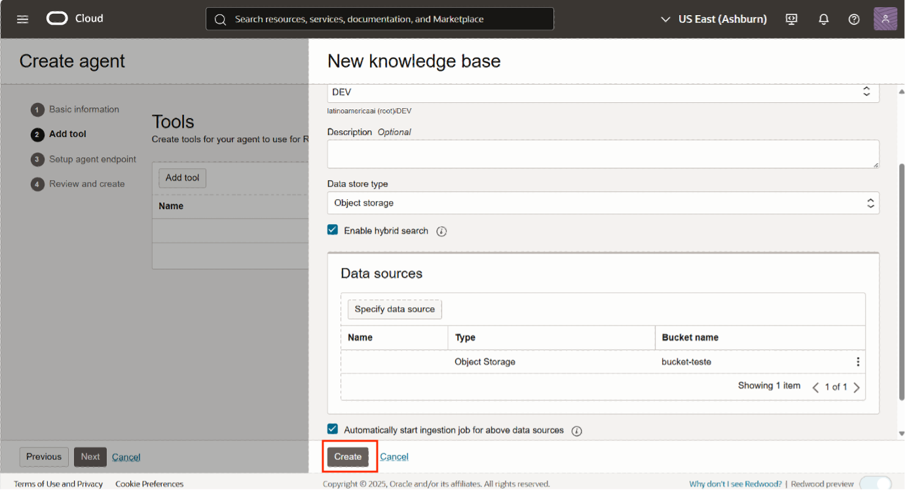

Debe aparecer en tus data sources; haz clic en `Create` nuevamente. No es necesario cambiar nada. 
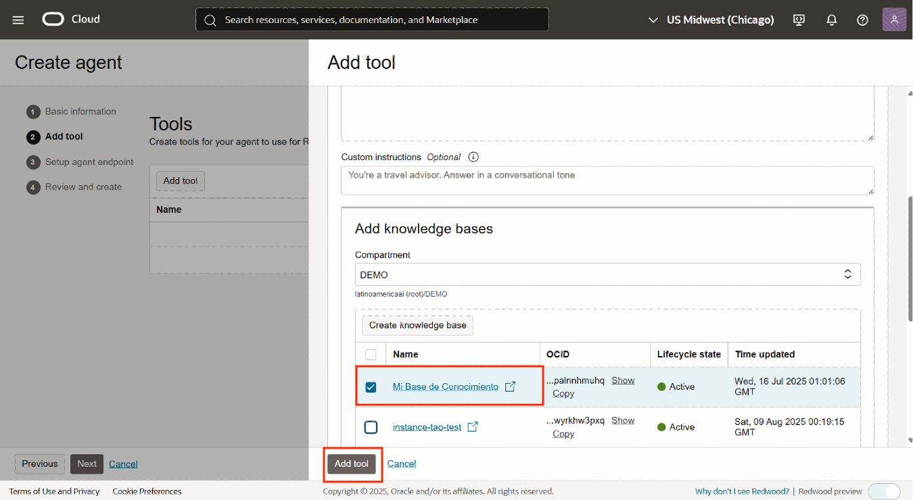

Selecciona tu base de conocimiento creada y haz clic en `Add tool`.  
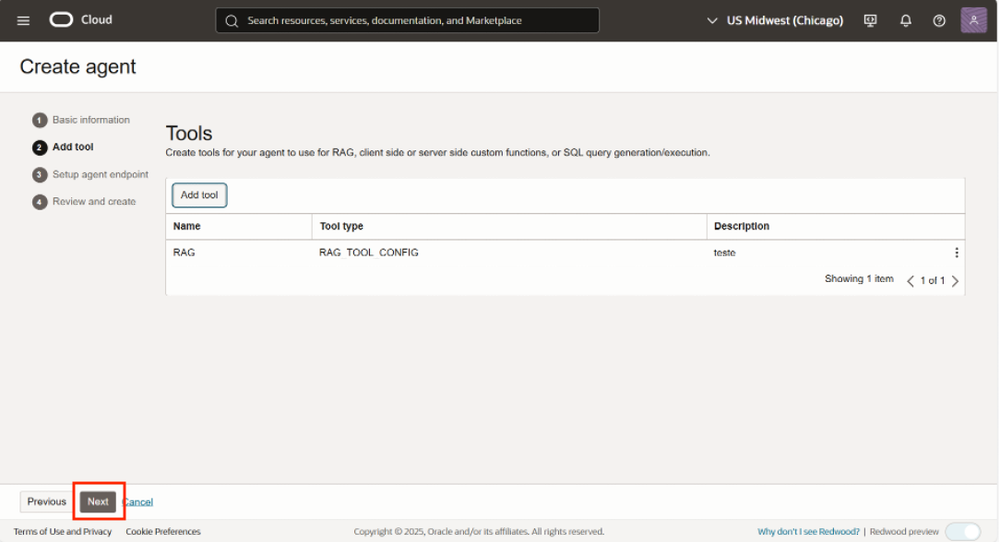

En este momento tendrás tu herramienta de base de conocimiento creada y conectada al bucket con tus PDFs. Podemos entonces avanzar al paso 3 haciendo clic en `Next`. 
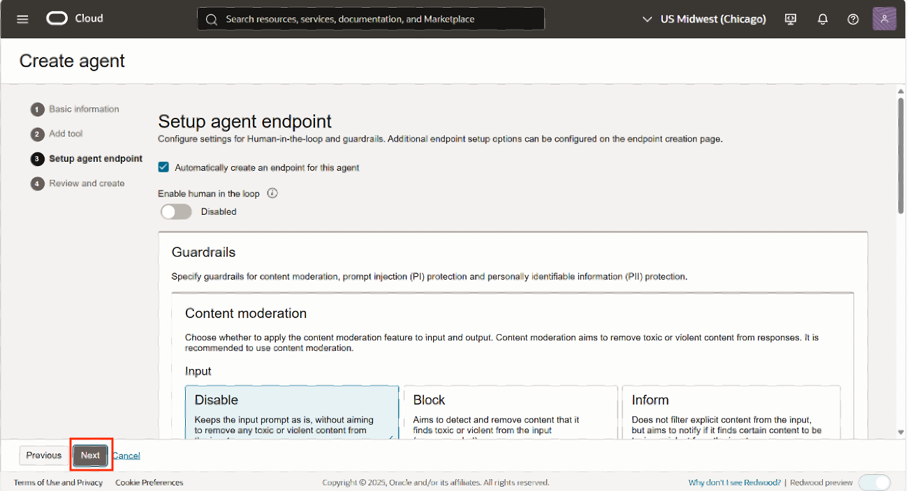

El siguiente paso es la configuración del endpoint; automáticamente el servicio creará el agente y un endpoint para que interactúes con él. Este endpoint puede tener algunas configuraciones de seguridad que ya están preconstruidas en OCI, como los Guardrails. Son muy importantes en casos reales; en este paso `Oracle ya ofrece 3 guardrails preconfigurados` para que los actives si quieres. Los guardrails son: 🛡️ moderación de contenidos violentos o inapropiados, 🔒 detección de intento de manipulación de prompt e 🔐 identificación del intercambio de información personal. En estos tres casos puedes elegir bloquear la acción o solo informar al usuario.
En nuestro laboratorio dejaremos todo por defecto, es decir, desactivado. Pero siéntete libre de probar nuevas posibilidades más tarde. Siguiendo al último paso, haremos clic en “Next” para llegar al 4.º paso. 
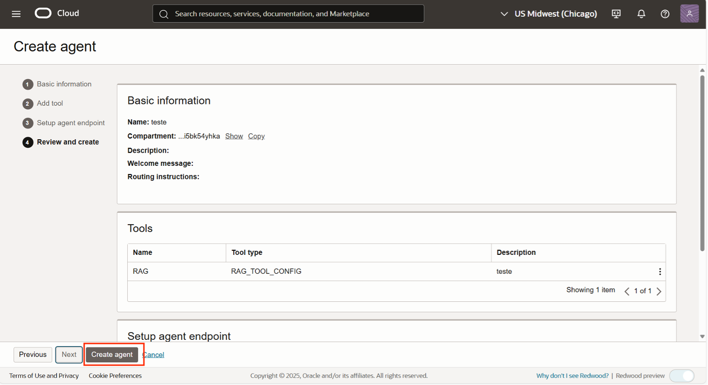

Esta etapa es solo para verificación; puedes revisar la información seleccionada y hacer clic en `Create agent` para concluir la creación del agente. 
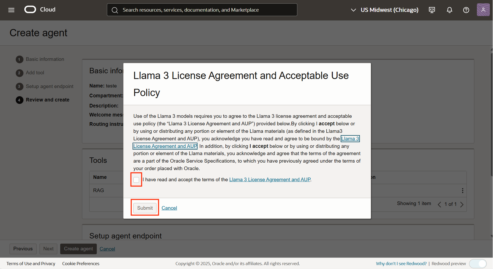

Cuando hagas clic en crear agente, aparecerá una licencia de Llama en tu pantalla; acéptala y haz clic en `Submit`. 
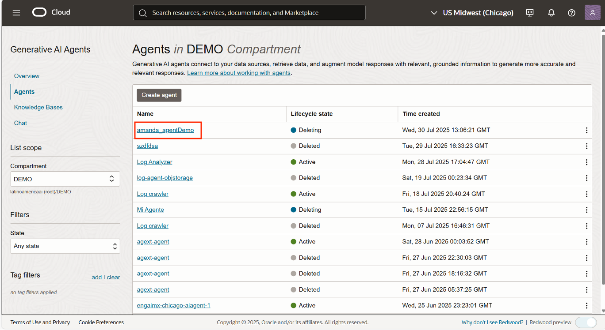

Tu agente debe aparecer con estado `Creating` ⏳. Espera hasta que quede activo; esto debería tardar en promedio 15 minutos ⏱️. Tan pronto como esté activo, haz clic en el nombre de tu agente para abrirlo.
`Nota:` ***Mientras se provisiona el agente vamos a avanzar en el laboratorio 03 con los prerequisitos que se encuentran en el lab 00*** ⏭️ 
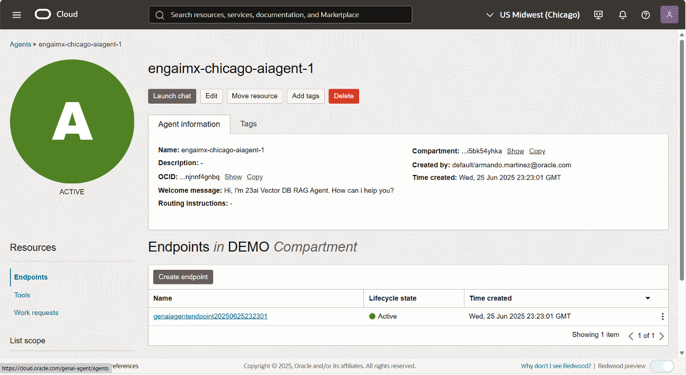

En esta página tienes acceso al endpoint, herramientas y toda la demás información de tu agente. Si está activo y también tiene un endpoint activo, el botón `Launch chat` estará habilitado. 

### 💬 2.3 Interactuando con mi agente
Una vez que el agente está activo y tiene un endpoint activo, ya puedes comunicarte con él. Una de las opciones es abrir el agente, como en la última imagen de la sesión anterior, y hacer clic en el botón `Launch chat`. O puedes ir a la página inicial del servicio de Generative AI Agents y hacer clic en el menú lateral izquierdo en la parte de `Chat`. 
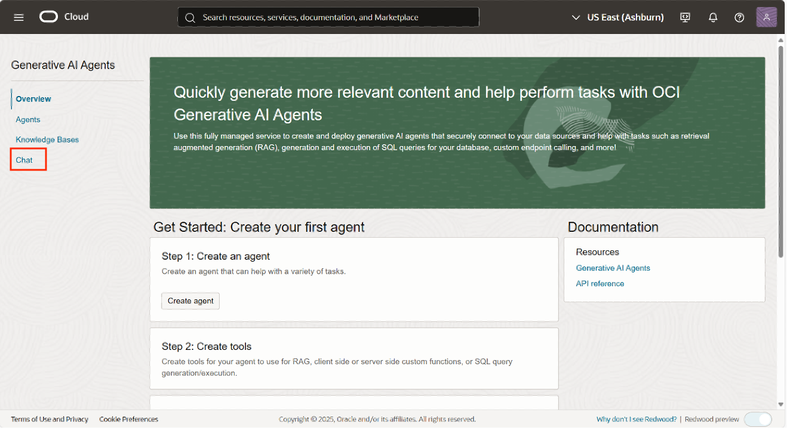

En la página de chat, tienes la opción de elegir alguno de los agentes activos en el menú flotante “Agent” y un endpoint en el menú `Agent endpoint`. En caso de que hayas accedido vía `Launch chat`, esa información ya estará completada. En esta pantalla también es posible notar que el mensaje de bienvenida del agente aparece de inmediato. 
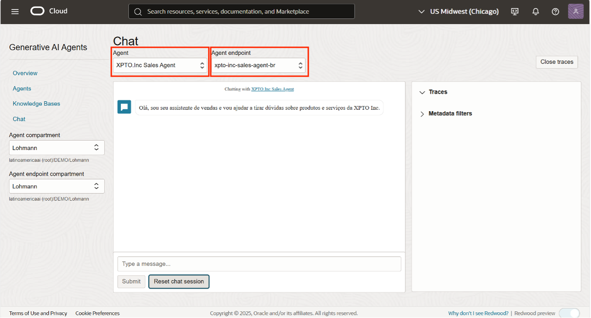

Cuando envíes una pregunta al agente, este la procesará y responderá directamente en la pantalla. Además de responder a tu pregunta, tu agente informará la cita de dónde provino la información, justo debajo de la respuesta.
Pregunta de ejemplo: `¿Me puedes resumir en 5 bullets lo principal del documento?`  
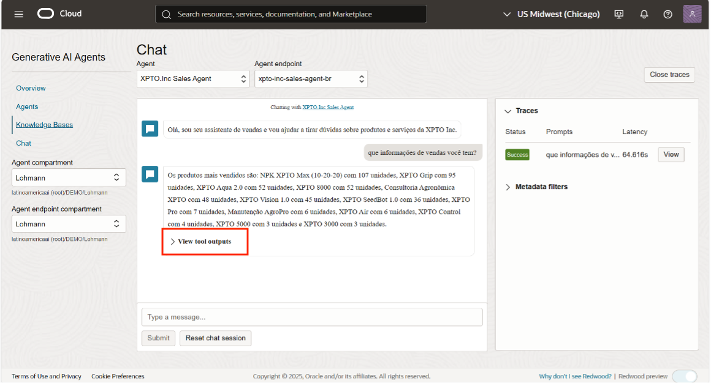

Otra capacidad interesante de esta pantalla es `Traces` 🔍; haciendo clic en `View` es posible ver la línea de pensamiento, paso a paso, que el agente siguió para construir su respuesta. Todos los documentos, las páginas y demás herramientas que utilizó para componer la respuesta final y su razonamiento para atender la solicitud. 
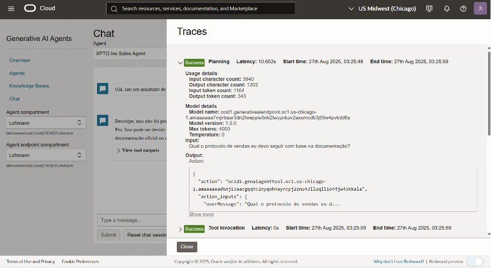

Traces es una herramienta poderosa 💪 para investigar lo que hizo el agente y poder ajustar el prompt. 

### ⚙️ 2.4 Ajustando el agente
Si no obtuviste la respuesta que te gustaría con tu agente, puedes editar algunas partes de él. En la pantalla principal del agente, puedes editar el prompt tanto del agente como de las tools. El prompt es la parte más importante de cualquier aplicación de IA generativa; no subestimes el poder de un prompt bien escrito.
Si tu problema son los archivos, al ser insertados en el bucket tienen ingestión automática; entonces, si tu ajuste es añadir documentación, puedes hacerlo directamente añadiéndola en el bucket. La ingestión de la nueva información debe tardar como máximo 2 minutos 
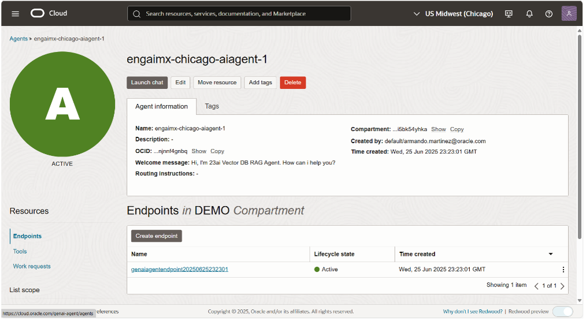

🎉 Has creado tu primer agente totalmente sin código con OCI 

`¡Felicitaciones!` 🎊 Ahora ya tienes conocimientos para crear agentes para los más variados casos. Explora la herramienta y transfórmala en aplicaciones reales que agreguen valor 💎. No dejes de aventurarte también con las demás herramientas 🗄️ SQL tool, 🔧 Custom tool y 🤖 Agent tool para casos de uso más complejos.

