# Oracle SQLcl MCP Server with Oracle AI Database

Guía paso a paso para configurar y utilizar el **servidor MCP de SQLcl** con un agente de IA (por ejemplo, Cline o Copilot) en **VS Code**, conectado a una base de datos **Oracle AI Database**.

---

## Índice

- [Introducción](#introducción)  
- [Objetivo del laboratorio](#objetivo-del-laboratorio)  
- [Requisitos previos](#requisitos-previos)  
- [Tarea 1: Descargar la cartera (wallet)](#tarea-1-descargar-su-cartera)  
- [Tarea 2: Instalar la extensión Oracle SQL Developer para VS Code](#tarea-2-instalación-de-la-extensión-sql-developer-para-vscode)  
- [Tarea 3: Instalación de la extensión Cline](#tarea-3-instalación-de-la-extensión-de-cline)  
- [Tarea 4: Instalación de SQLcl](#tarea-4-instalación-de-sqlcl)  
- [Tarea 5: Configuración de Cline con el servidor MCP SQLcl](#tarea-5-configuración-de-cline-con-el-servidor-mcp-sqlcl)  
- [Tarea 6: Uso del servidor MCP SQLcl con Cline](#tarea-6-uso-del-servidor-mcp)  
- [Registro de operaciones en DBTOOLS$MCP_LOG](#registro-de-operaciones-en-dbtoolsmcp_log)  

---

## Introducción

En este laboratorio aprenderás a configurar y utilizar el **servidor MCP de SQLcl** con un agente de IA en **VS Code**. El servidor MCP SQLcl permite conectar tu base de datos **Oracle AI Database** a asistentes de IA, ya sea **GitHub Copilot, Cline, Claude Desktop** o cualquier otra herramienta que admita el protocolo **Model Context Protocol (MCP)**.

El servidor MCP actúa como un **puente seguro** entre la base de datos y las herramientas de IA, permitiendo utilizar **lenguaje natural** para:

- Interactuar con tus datos  
- Ejecutar consultas SQL  
- Ejecutar comandos de administración de base de datos  

En lugar de escribir SQL desde cero, puedes **describir lo que deseas hacer** y dejar que el asistente de IA maneje los detalles técnicos.

Para esta demostración usaremos **VS Code con Copilot y Cline**, pero los pasos también funcionan con otros agentes compatibles con MCP. Una vez configurado, podrás utilizar lenguaje natural para:

- Enumerar conexiones  
- Ejecutar scripts SQL  
- Crear un **juego de trivia** simple a partir de datos almacenados en la base de datos  

> ⏱ **Tiempo de laboratorio estimado:** 20 minutos

---

## Objetivo del laboratorio

Al final de este laboratorio serás capaz de:

- Descargar y configurar **SQLcl** (con soporte MCP).  
- Instalar y configurar las extensiones **Oracle SQL Developer** y **Cline** para VS Code.  
- Conectarte a **Oracle AI Database** mediante una **cartera (wallet)**.  
- Configurar los valores de **MCP** en VS Code.  
- Utilizar el servidor **MCP SQLcl** con un agente de IA para:
  - Mostrar las conexiones disponibles.  
  - Ejecutar sentencias SQL y scripts SQLcl.  
  - Crear y poblar una tabla para un **juego de trivia**.

---

## Requisitos previos

Este laboratorio asume que cuentas con lo siguiente:

- **Acceso a Internet**.
- Acceso a una **base de datos Oracle AI** (FreeSQL, LiveSQL o una base de datos autónoma con cartera).  
- **Credenciales de cuenta Oracle** válidas.  
- **Visual Studio Code (VS Code)** instalado en tu máquina.  


---

## Tarea 1: Descargar su cartera

> 💡 Si ya tienes la **wallet** de una base de datos de laboratorios anteriores, puedes pasar directamente a la **Tarea 2**.

### ¿Qué es una cartera (wallet)?

Una **cartera (wallet)** es un archivo seguro que contiene:

- Credenciales de conexión  
- Certificados necesarios para acceder a **Oracle Autonomous Database**

Esta cartera garantiza que la conexión a la base de datos esté **cifrada y autenticada**.

### ¿Por qué la necesitas?

Vamos a utilizar la **cartera** para conectar la extensión de **Oracle SQL Developer para VS Code** a nuestra base de datos autónoma.

### Pasos

1. En la página inicial de la base de datos autónoma, haz clic en la opción de **Database Connection** y descarga la **cartera (wallet)** de la base de datos.

   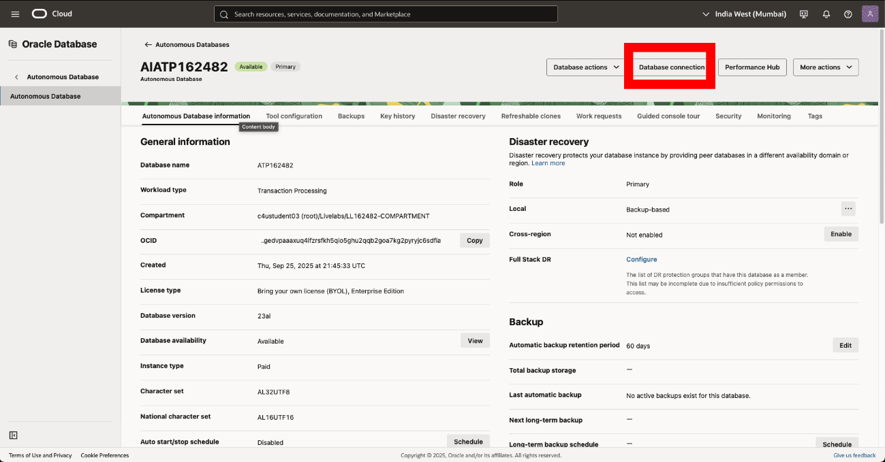

   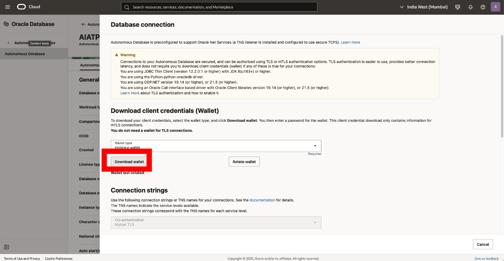

2. Proporciona una contraseña para la cartera. Puedes usar la que prefieras, pero **no la olvides**.  
   Para este taller se sugiere usar:

   ```text
   Contraseña de la cartera: OracleAIworld2025
   ```

Luego haz clic en **Download** en la parte inferior derecha.

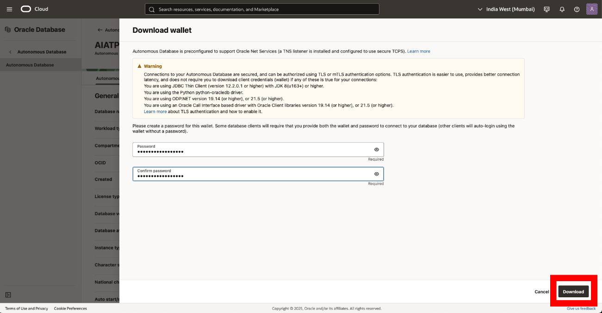

3. **Verificar la descarga:** comprueba que se haya descargado un archivo `.zip` en tu computador (normalmente en la carpeta **Descargas**).
   Este archivo contiene las **credenciales de la cartera**.
4. ### Nota Importante:
   El archivo del wallet luego que se descarga esta en tu computador local y debes copiarlo a la maquina virtual. Windows Remote Desktop permite hacer `Copy` y `Paste` por lo tanto puedes en tu maquina local darle `Copy` al archivo wallet y en la maquina virtual abres el `**File Explorer**` y das la opcion de `Paste`.

---

## Tarea 2: Instalación de la extensión miniconda, VSCODE y Extensiones de VSCODE
### Instalar miniconda
Dentro de la maquina virtual abres un explorador (edge) y copias la siguiente url.
- https://idi1o0a010nx.objectstorage.us-chicago-1.oci.customer-oci.com/n/idi1o0a010nx/b/archivos_publicos/o/Miniconda3-latest-Windows-x86_64.exe<br>
Luego de la descarga solo la ejecutas y vas indicando `Next` en cada paso y lo mantienes tal cual si hacer cambios.
Ahora te toca instalar VSCODE dentro de la maquina virtual y en el mismo explorador copias la siguiente url.<p>

### Instalar VSCODE
Realizas el mismo paso de copiar la siguiente url y la pegas en el explorador (edge)
- https://idi1o0a010nx.objectstorage.us-chicago-1.oci.customer-oci.com/n/idi1o0a010nx/b/archivos_publicos/o/VSCodeUserSetup-x64-1.105.1.exe<br>
Luego de la descarga solo la ejecutas y vas indicando `Next` en cada paso y lo mantienes tal cual si hacer cambios.

### Instalacion de la extension SQL Developer
### ¿Qué hace esta extensión?

La extensión **Oracle SQL Developer** para VS Code permite:

* Trabajar con bases de datos **Oracle AI**
* Gestionar conexiones, ejecutar consultas y scripts desde VS Code

### ¿Por qué la necesitas?

Esta extensión almacenará los **detalles de conexión** de tu base de datos y será la base para que Cline, a través de SQLcl, pueda interactuar con ella.

### Pasos

1. Una vez instalado, abre VS Code y ve a la vista **Extensions** (icono de cuadraditos en la barra lateral).

2. En el cuadro de búsqueda, escribe:

   ```text
   Oracle SQL Developer
   ```

   y haz clic en **Install** (o instálalo directamente desde el Marketplace de VS Code).

   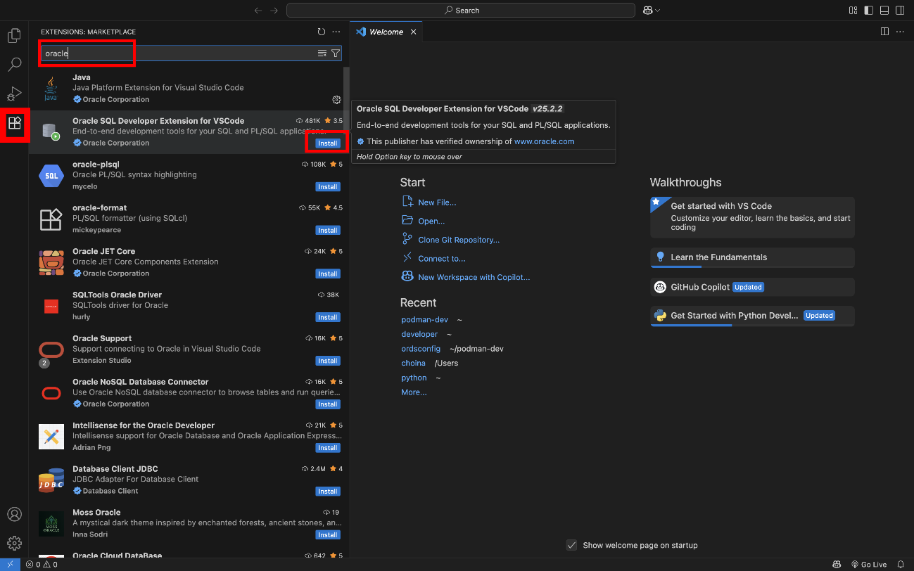

3. Una vez instalada la extensión, ábrela desde la barra de actividades (panel lateral izquierdo).

   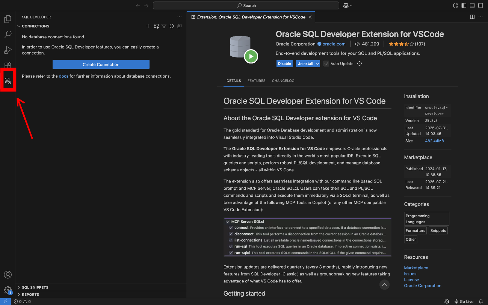

4. Haz clic en **Create Connection**.

   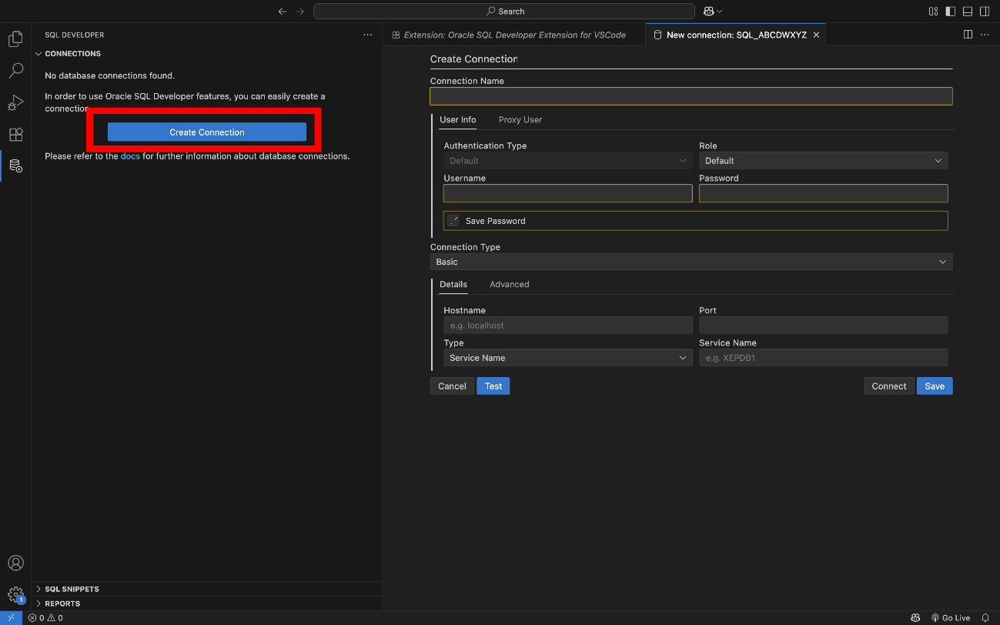

5. Introduce los detalles de la conexión de la cartera:

   * **Connection name:** `AIWorld-HOL`
   * **User:** `ADMIN`
   * **Password:** `[contraseña que se definió en el despliegue de la BD]`
   * Marca la casilla para **guardar la contraseña**.
   * En **Connection Type**, selecciona: `Cloud Wallet`.
   * Haz clic en **Choose file** y selecciona el archivo `.zip` de la cartera descargada en la Tarea 1.

6. Haz clic en **Test** para verificar que la conexión funcione y luego en **Save**.

   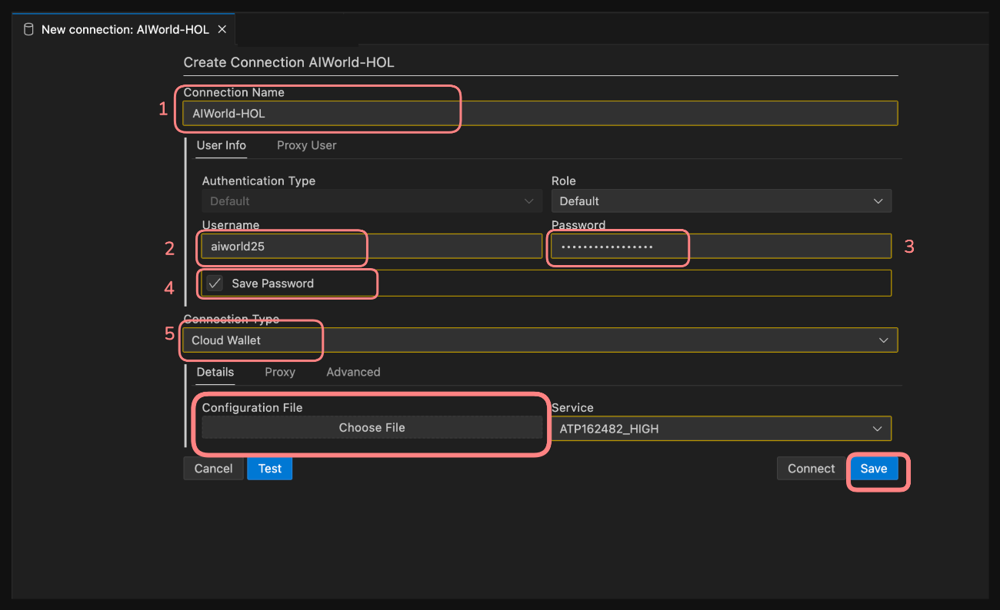

7. **Verificar la configuración:**
   Debería aparecer la nueva conexión `AIWorld-HOL` en el panel de la extensión **Oracle SQL Developer**.
   Si la prueba de conexión falla:

   * Revisa las credenciales (usuario/contraseña).
   * Comprueba que seleccionaste el archivo de cartera correcto.

---

## Tarea 3: Instalación de la extensión de Cline

**Cline** es un agente de **codificación de IA de código abierto** que se integra con VS Code.

### Instalación

1. En VS Code, abre la vista de **Extensions** y busca:

   ```text
   Cline
   ```

   Luego haz clic en **Install**.

   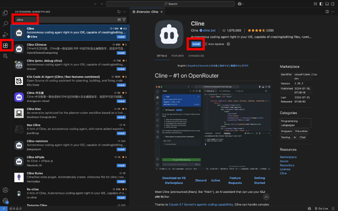

2. Abre **Cline** desde la barra de actividades.

   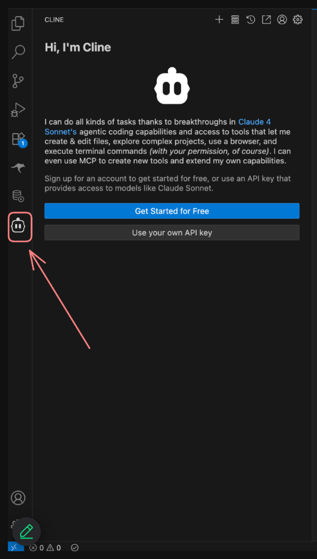

### Configuración del proveedor de IA

Cline soporta varios proveedores de IA. Tienes, por ejemplo:

* Servicio gratuito de Cline
* API keys propias (OpenAI, Anthropic, otros)
* Uso de **Oracle Code Assist** con Oracle SSO

Para esta demostración se utilizará la **opción gratuita**.

1. Haz clic en **Introducción gratuita** si deseas utilizar el servicio gratuito de Cline.

   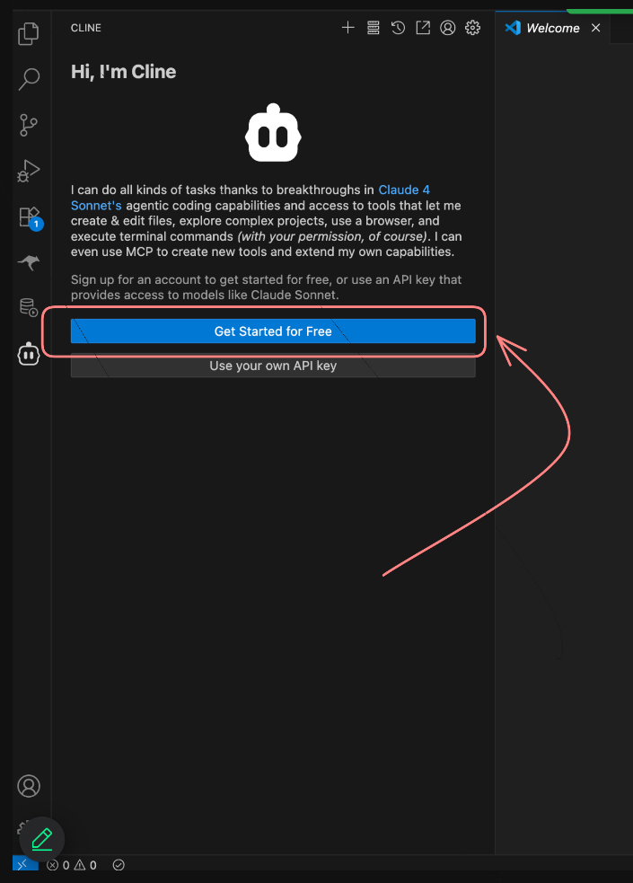

2. Si utilizas el servicio gratuito de Cline, se te pedirá que te registres.
   Sigue las instrucciones para crear una cuenta (esto es opcional si ya tienes tus propias claves de API).

3. Configura el **modelo de IA**:

   * Haz clic en el icono de engranaje para abrir la **configuración de Cline**.
   * Haz clic en **API Settings**.

   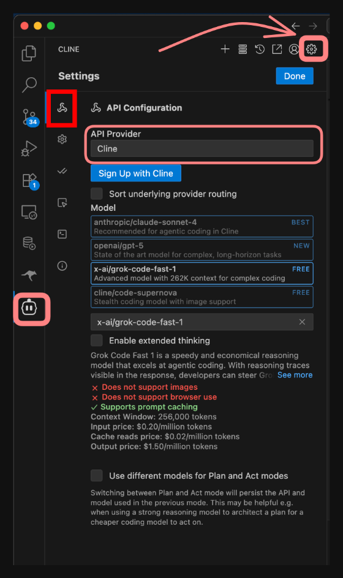

4. Selecciona tu **proveedor** y **modelo de IA** preferido.
   Para la opción gratuita, elige uno de los modelos gratuitos disponibles de Cline.

   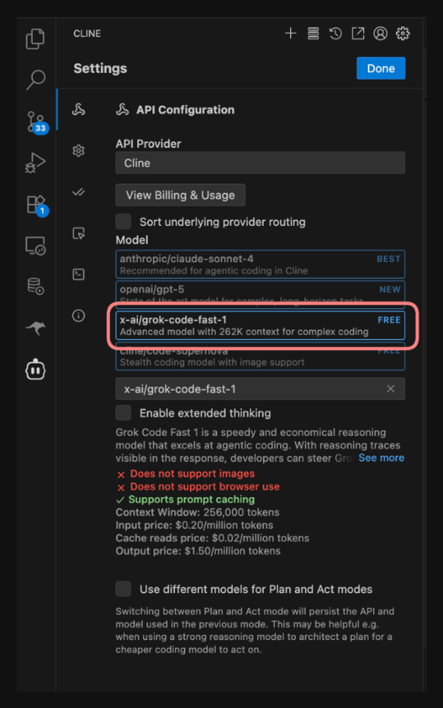

---

## Tarea 4: Instalación de SQLcl

### ¿Qué es SQLcl?

**SQLcl** es la interfaz moderna de línea de comandos de Oracle para trabajar con bases de datos Oracle.
Incluye la funcionalidad de **servidor MCP**, que permite a asistentes de IA y agentes de codificación interactuar con la base de datos de forma segura.

> ⚠️ **Importante:**
> Necesitas la versión **25.2 o posterior** de SQLcl, la cual puedes descargar del siguiente link en un navegador.
> https://www.oracle.com/database/sqldeveloper/technologies/sqlcl/download/
> La funcionalidad de servidor MCP se introdujo en la versión 25.2; versiones anteriores no funcionarán para este laboratorio.

### Opciones de instalación

#### Opción 1: Descarga directa (recomendada)

1. Descarga SQLcl (versión **25.2 o posterior**) desde la página oficial de Oracle.
   La herramienta SQLcl se ofrece bajo la **Licencia de uso libre (Free Use)**.

2. Descomprime la carpeta descargada en una ubicación que recuerdes.
   Para esta demostración se usará la carpeta **Descargas**, pero puedes elegir cualquier ubicación de tu preferencia.

   

#### Opción 2: Instalar a través de Homebrew (usuarios de macOS)

En macOS, puedes instalar SQLcl con:

```bash
brew install --cask sqlcl
```

### Verificar la instalación

* Si has descargado el archivo `.zip` y lo has descomprimido, deberías ver una carpeta llamada `sqlcl` con un directorio `bin` en su interior.
* Si has utilizado Homebrew, `sql` debería estar disponible en tu `PATH` del sistema.

> 💡 Toma nota de la **ruta completa** a la instalación de SQLcl.
> La necesitarás en la **Tarea 5** para configurar Cline con el servidor MCP.

---

## Tarea 5: Configuración de Cline con el servidor MCP SQLcl

### ¿Qué hace esta configuración?

Este paso conecta **Cline (tu asistente de IA)** con el **servidor MCP de SQLcl**.
Una vez configurado, Cline podrá:

* Ejecutar comandos de base de datos en tu nombre.
* Utilizar lenguaje natural para invocar herramientas (`list-connections`, `run-sqlcl`, `SQL`, etc.).

### ¿Por qué es importante?

Sin esta configuración, Cline **no puede acceder** a la base de datos.
El servidor MCP actúa como un **puente seguro**, permitiendo que Cline:

* Ejecute consultas SQL.
* Gestione las conexiones a la base de datos de forma controlada.

### Pasos de configuración

1. En VS Code, haz clic en la extensión **Cline** en la barra izquierda y luego en el ícono **MCP Servers** en la parte superior.

   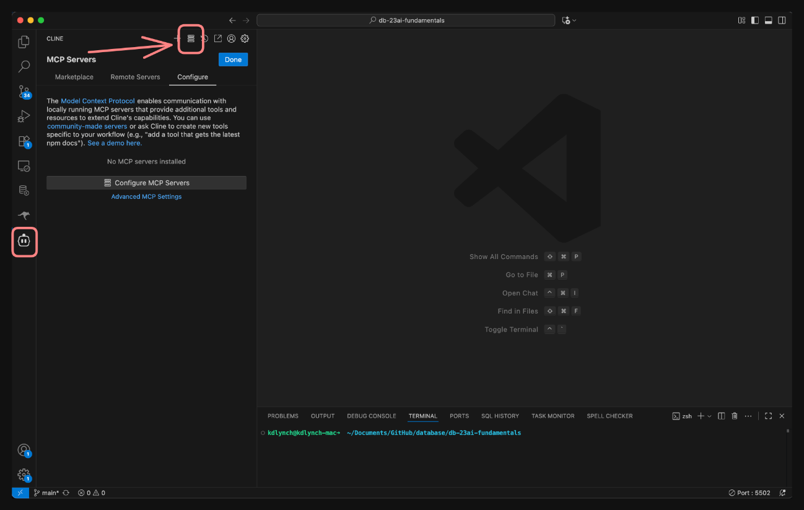

2. Haz clic en **Configure** y luego en **Configure MCP Servers**.
   Esto abrirá un archivo de configuración en formato **JSON**.

   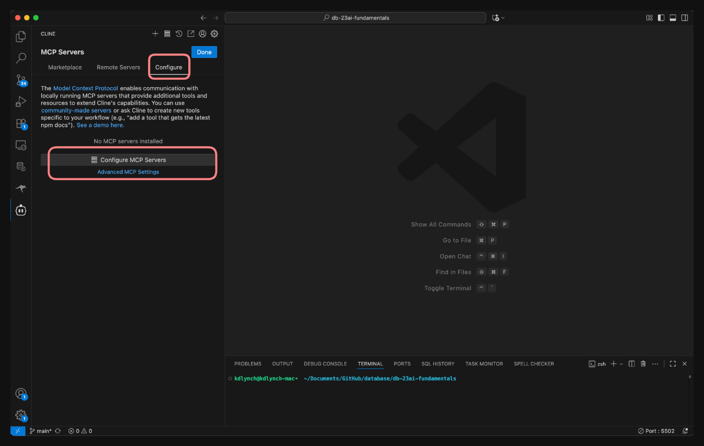

3. Actualiza la configuración JSON con la ruta de SQLcl.
   Sustituye el texto del marcador de posición por la ruta real a la instalación de SQLcl obtenida en la Tarea 4.

   * Para SQLcl descargado manualmente: usa la ruta a la carpeta descomprimida, por ejemplo:
     `/Users/tu_usuario/Downloads/sqlcl/bin/sql`
   * Para instalación con Homebrew en macOS Apple Silicon:
     `/opt/homebrew/bin/sql`
   * Para Macs más antiguos con Homebrew en `/usr/local`:
     `/usr/local/bin/sql`

   ```json
   {
     "mcpServers": {
       "sqlcl": {
         "command": "[ACTUALIZAR ESTO CON SU RUTA A SQLCL]/bin/sql",
         "args": ["-mcp"]
       }
     }
   }
   ```

   Rutas de ejemplo:

   * Descargado: **`/Users/yourname/Downloads/sqlcl/bin/sql`**
   * Homebrew: **`/opt/homebrew/bin/sql`**

   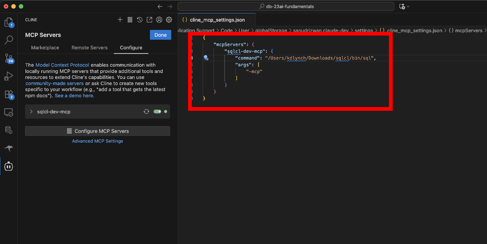

   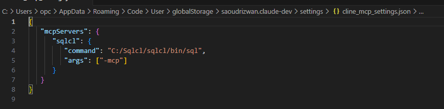

4. **Nota sobre Java:**
   Para configurar y utilizar SQLcl es requisito previo tener **Java** instalado.
   Si aparece una ventana solicitando su instalación, simplemente procede a instalar Java antes de continuar con la configuración. 
   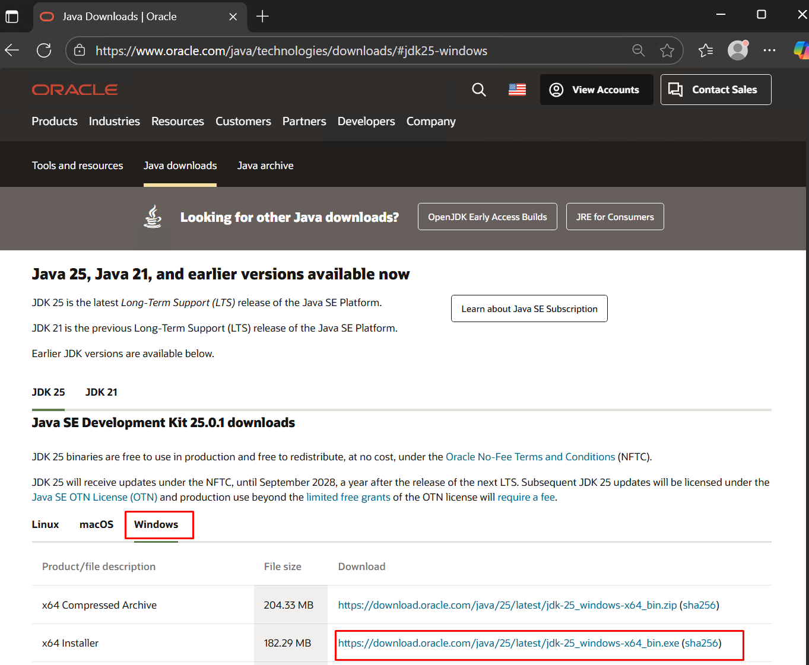

5. Guarda el archivo de configuración JSON.
   Deberías ver que `sqlcl` aparece en la sección **Installed MCP Servers**.
   Si el botón aparece en rojo, haz clic en el botón de **refrescar**.Es posible que durante la instalacion la pantalla de los servidores `MCP` en `Cline` indique problemas de conexion al servidor MCP, debes refrescar posterior a la instalacion de Java y ahi indicara de manera correcta que conecto al servidor MCP.


   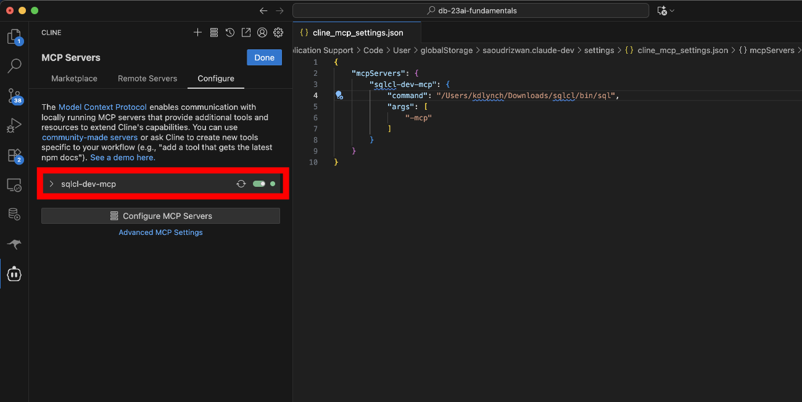

### Verificar la configuración

* `sqlcl` debe aparecer en la lista **Installed MCP Servers**.
* Si no lo ves, revisa la ruta del archivo en la configuración JSON.
* Si hay un error, asegúrate de que la instalación de SQLcl funciona correctamente probándola en una terminal:

```bash
sql -v
```

Haz clic en cualquier parte de la barra de `sqlcl` para expandirla. Verás las herramientas de base de datos que Cline ahora puede utilizar:

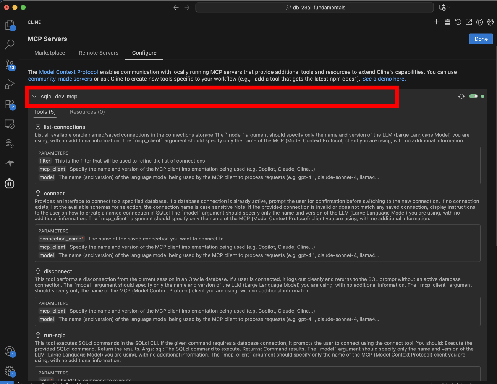

Herramientas disponibles:

* `list-connections`: muestra las conexiones de base de datos guardadas.
* `connect`: se conecta a una base de datos específica.
* `disconnect`: se desconecta de forma segura de la base de datos.
* `run-sqlcl`: ejecuta comandos SQLcl.
* `SQL`: ejecuta consultas SQL.

Haz clic en **Done** para completar la configuración.


> ✅ Lo que has logrado:
> Cline ahora puede comunicarse de forma segura con tu **base de datos Oracle AI** a través del servidor MCP de SQLcl.
> Estás listo para empezar a utilizar **lenguaje natural** para interactuar con tus datos.

---

## Tarea 6: Uso del servidor MCP

En esta tarea utilizarás **lenguaje natural** para interactuar con **Oracle AI Database** mediante **Cline** y el servidor **MCP SQLcl**.
Realizarás acciones como:

* Enumerar conexiones
* Cargar datos de ejemplo
* Crear una **aplicación de trivia** sencilla

### Modos de Cline

Cline tiene dos modos principales:

* **Plan Mode:** Cline crea un plan y solicita tu aprobación antes de ejecutarlo.
* **Act Mode:** Cline ejecuta inmediatamente las acciones (se debe usar con precaución).

> 🔐 **La seguridad es lo primero:**
> Mantén siempre desactivada la opción **"Aprobación automática"** para revisar lo que Cline desea hacer antes de que actúe.

Asegúrate de:

* Estar en **Plan Mode**.
* Tener desactivada la opción **"Auto-Approve" / "Aprobación automática"**.


> ⚠️ **IMPORTANTE:**
> Para seguir las buenas prácticas de seguridad, asegúrate de que la opción **"Aprobación automática"** esté desactivada.

---

### 6.1. Listar conexiones mediante lenguaje natural

Activa el **Plan Mode**.
En el área de entrada de tareas de Cline, escribe el siguiente mensaje:

```text
Usando el servidor MCP SQLcl, muestre mis conexiones a la base de datos.
```

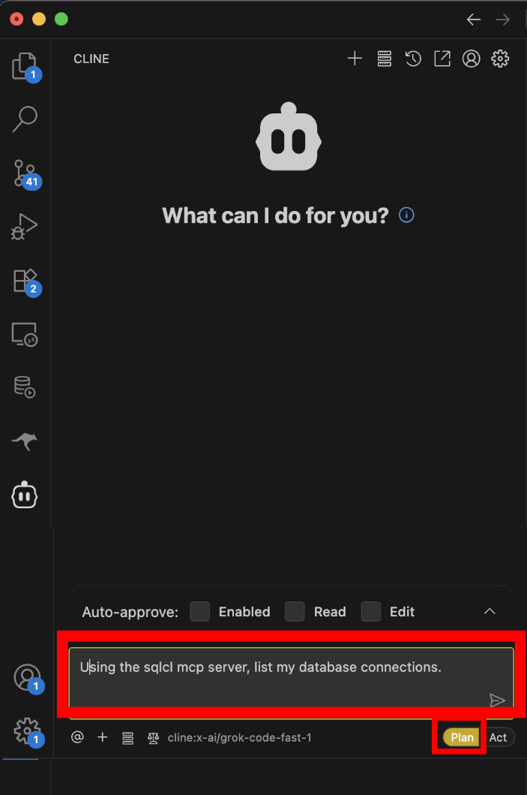

Cline creará un plan y pedirá permiso para utilizar la herramienta `list-connections`.
Revisa la solicitud y haz clic en **Approve** si todo parece correcto.


La salida devolverá la lista de conexiones disponibles para el servidor MCP SQLcl.
Aquí puedes ver, por ejemplo, la conexión `AIWorld-HOL` que se creó anteriormente en el laboratorio:

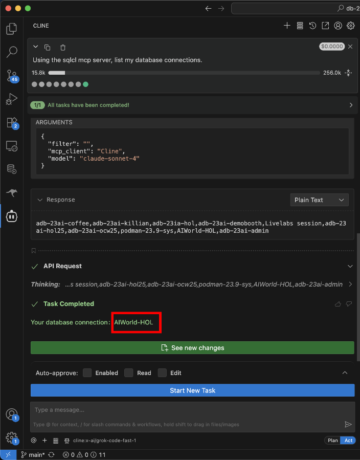

---

### 6.2. Crear datos de prueba para la aplicación de trivia

El objetivo es crear una **aplicación de trivia** con preguntas de la historia de Oracle.
Primero necesitamos crear los datos en la base de datos.

1. Crea un nuevo archivo en VS Code llamado:

   ```text
   trivia-data.sql
   ```

2. Descarga o consulta el script desde:

   ```text
   SQL Script:
   https://oracle-livelabs.github.io/database/db-23ai-fundamentals/ai-world-2025/trivia-data.sql
   ```

3. Copia el siguiente contenido en `trivia-data.sql`.
   Este script eliminará la tabla (si existe), creará la tabla de trivia y cargará las preguntas:

```sql
-- Borrar la tabla si ya existe (opcional para un restablecimiento limpio)
DROP TABLE trivia_questions CASCADE CONSTRAINTS;

-- Crear la tabla de trivia
CREATE TABLE trivia_questions (
   id            NUMBER GENERATED BY DEFAULT AS IDENTITY PRIMARY KEY,
   question_text VARCHAR2(500) NOT NULL,
   answer_text   VARCHAR2(200) NOT NULL,
   categoria     VARCHAR2(50)  DEFAULT 'Oracle History',
   dificultad    VARCHAR2(20)  DEFAULT 'Medium'
);

-- Insertar trivia de historial de Oracle
INSERT INTO trivia_questions (question_text, answer_text, dificultad) VALUES
('¿En qué año se fundó Oracle?', '1977', 'Medium');

INSERT INTO trivia_questions (question_text, answer_text, dificultad) VALUES
('¿Qué versión principal de Oracle Database introdujo PL/SQL?', 'Oracle 6', 'Medium');

INSERT INTO trivia_questions (question_text, answer_text, dificultad) VALUES
('¿Qué versión introdujo Real Application Clusters (RAC)?', 'Oracle 9i', 'Medium');

INSERT INTO trivia_questions (question_text, answer_text, dificultad) VALUES
('Oracle 10g hizo hincapié en qué modelo de computación en su marca?', 'Grid computing', 'Easy');

INSERT INTO trivia_questions (question_text, answer_text, dificultad) VALUES
('Oracle 12c introdujo una nueva arquitectura para la consolidación. ¿Cómo se llama?', 'Multitenant (CDB/PDB)', 'Easy');

INSERT INTO trivia_questions (question_text, answer_text, dificultad) VALUES
('¿Qué empresa adquirió Oracle en 2010 que lo convirtió en administrador de Java y MySQL?', 'Sun Microsystems', 'Easy');

INSERT INTO trivia_questions (question_text, answer_text, dificultad) VALUES
('Exadata, sistema de ingeniería de Oracle para bases de datos, debutó en qué década?', '2000s (2008)', 'Medium');

INSERT INTO trivia_questions (question_text, answer_text, dificultad) VALUES
('¿En qué año se anunció por primera vez la base de datos autónoma?', '2017', 'Medium');

INSERT INTO trivia_questions (question_text, answer_text, dificultad) VALUES
('¿Cuál es el nombre interno del motor relacional que inspiró el nombre del producto original de Oracle?', 'Oracle (de un nombre en clave de proyecto de la CIA)', 'Hard');

INSERT INTO trivia_questions (question_text, answer_text, dificultad) VALUES
('¿Quién fue el primer cliente de Oracle?', 'La CIA', 'Medium');

INSERT INTO trivia_questions (question_text, answer_text, dificultad) VALUES
('¿Qué nombre de versión de Oracle introdujo el concepto de "c" para la nube?', 'Oracle 12c', 'Easy');

-- Guardar los datos
COMMIT;
```

4. Guarda el archivo `trivia-data.sql` en VS Code.

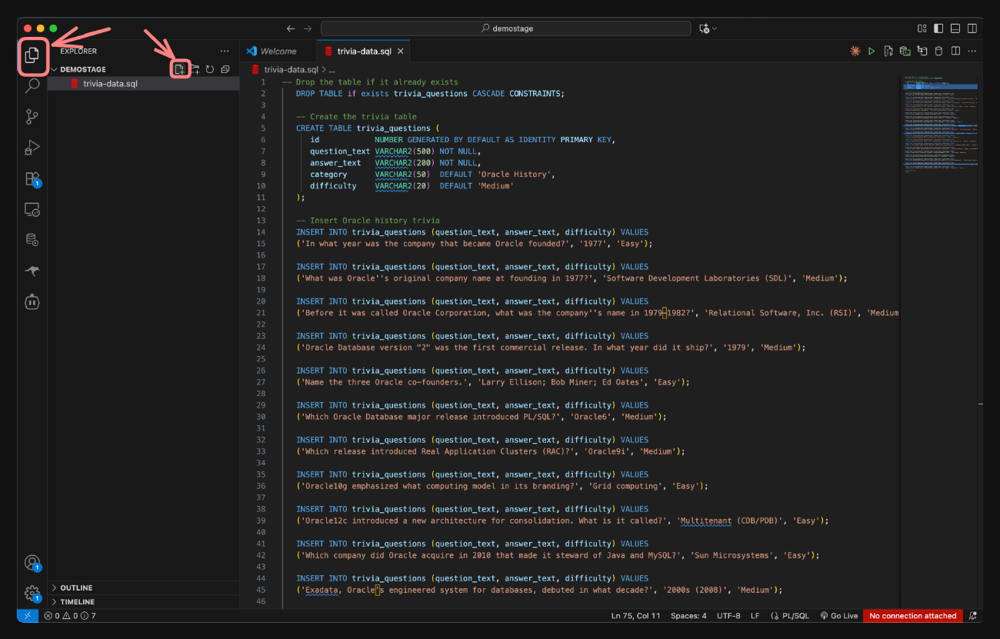

---

### 6.3. Cargar los datos utilizando Cline y run-sqlcl

Pídele a Cline que cargue los datos en la base de datos.
En el área de entrada de Cline, escribe:

```text
Utiliza run-sqlcl para cargar el script @/trivia-data.sql en la conexión a la base de datos AIWorld-HOL.
```

Revisa el plan: Cline mostrará lo que desea hacer.
Esta es tu oportunidad para verificar los comandos SQL antes de ejecutarlos.
Haz clic en **Approve** si todo es correcto.

El servidor MCP debe confirmar la ejecución correcta y deberías ver que:

* Se creó la tabla `trivia_questions`.
* Se insertaron las filas con datos de prueba.


---

### 6.4. Crear una aplicación web de trivia

Ahora utilizaremos la base de datos para construir algo útil.

Pídele a Cline lo siguiente:

```text
Créame una aplicación web de trivia simple para una presentación de conferencia. 
La aplicación debe mostrar las preguntas y los datos que almacenamos en la base de datos. 
En aras de la simplicidad, haga un sitio estático.
```

Cline creará un plan para generar la aplicación.
Revisa cuidadosamente las consultas SQL que planea utilizar para asegurarte de que coincidan con la estructura de datos de `trivia_questions`.

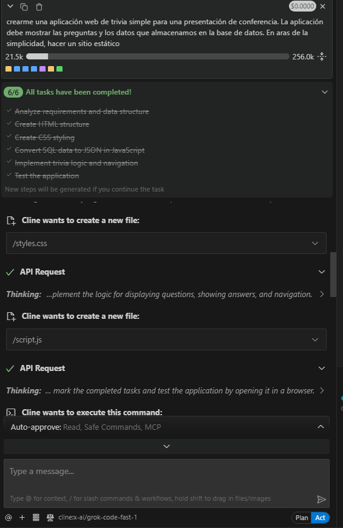

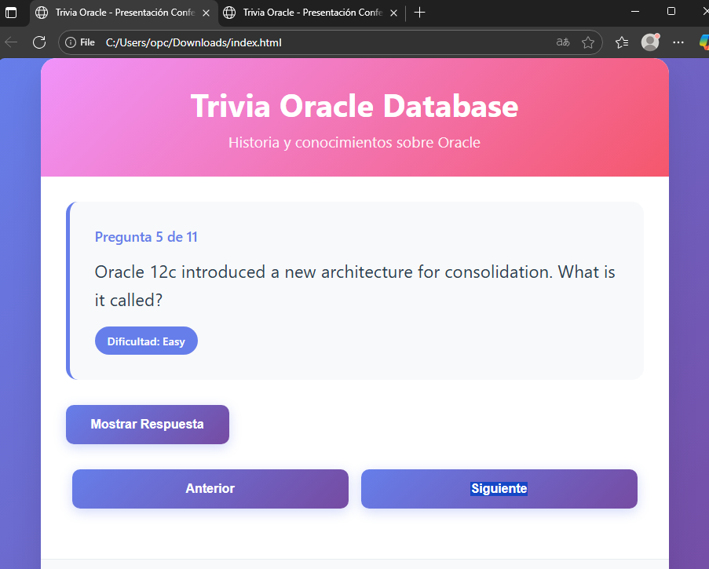

---

### 6.5. Consultar la tabla de trivia con lenguaje natural

Ejemplo de petición:

```text
Respóndeme la siguiente pregunta: "Which release introduced Real Application Clusters (RAC)?" utilizando la tabla trivia_questions.
```

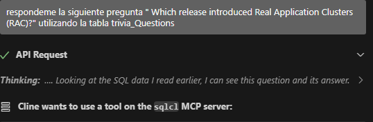

> ⚠️ **Advertencia:**
> Revisa siempre las sentencias SQL que Cline desea ejecutar.
> Puedes ajustar la petición de datos para hacerla más específica sobre qué consultas utilizar.

**Qué deberías ver:**
Cline creará una **aplicación de trivia funcional** utilizando los datos de la base de datos, demostrando el poder de la interacción en **lenguaje natural** con Oracle AI Database a través de SQLcl y MCP.

---

### 6.6. Desconexión segura

Cuando termines, pide a Cline que cierre la conexión a la base de datos para limpiar los recursos:

```text
Desconéctese de la conexión a la base de datos.
```

Aprueba la solicitud de desconexión para garantizar una finalización adecuada de la sesión.

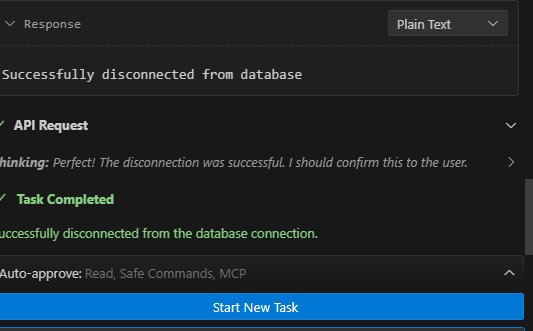

---

## Registro de operaciones en DBTOOLS$MCP_LOG

El servidor MCP SQLcl registra todas las operaciones en la tabla:

```sql
DBTOOLS$MCP_LOG
```

Puedes consultar esta tabla para ver un historial de:

* Scripts SQL ejecutados
* Sentencias PL/SQL
* Acciones realizadas por Cline en tu nombre a través del servidor MCP

---

**Gracias**

---


